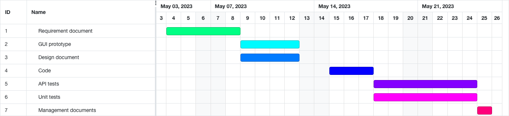

# Project Estimation - CURRENT
Date: 20 april 2023

Version: 1

# Estimation approach
Consider the EZWallet  project in CURRENT version (as received by the teachers), assume that you are going to develop the project INDEPENDENT of the deadlines of the course

# Estimate by size
### 
|             | Estimate                        |             
| ----------- | ------------------------------- |  
| NC =  Estimated number of classes to be developed   |        8                     |             
|  A = Estimated average size per class, in LOC       |        160                   | 
| S = Estimated size of project, in LOC (= NC * A) | 1280|
| E = Estimated effort, in person hours (here use productivity 10 LOC per person hour)  |                      128           |   
| C = Estimated cost, in euro (here use 1 person hour cost = 30 euro) | 3840| 
| Estimated calendar time, in calendar weeks (Assume team of 4 people, 8 hours per day, 5 days per week ) |           1         |               

# Estimate by product decomposition
### 
|         component name    | Estimated effort (person hours)   |             
| ----------- | ------------------------------- | 
|requirement document    | 80 |
| GUI prototype | 60 |
|design document | 58 |
|code |80|
| unit tests |80|
| api tests |80|
| management documents| 10|

# Estimate by activity decomposition
### 
|         Activity name    | Estimated effort (person hours)   |             
| ----------- | ------------------------------- | 
|Definition and division of the works of req document V2 | 2 |
|Discussion about solutions| 4 |
| Stakeholders | 8 |
| Context Diagrams and Interfaces | 4 |
| System Design |4 |
| Stories and Personas | 4 |
| Use Case Diagram and Use Cases | 12 |
| Functional Requirements | 4 |
| Non Functional Requirements | 4 |
| Glossary | 6 |
| Deployement Diagram | 4 |
| GUI V1 registration and login | 10 |
| GUI V1 home page | 10 |
| design document: context | 5 |
| design document: design | 25 |
| design document: tasks | 20 |
| code: controllers | 30 |
| code: db installation and configuration | 16 |
| code: routes design and configuration | 8 |
|code : new feautures | 20 |
| unit tests: writing |10|
| unit tests: testing |10|
| unit tests: fixing |30|
| api tests: wrinting |10|
| api tests: testing |10|
| api tests: fixing |30|
| management documents| 10|

# Summary

The results differ because diffrent approaces may lead to diffrent results.
Focusing on estimating little task (as for the decomposition approach) may lead to better results.

|             | Estimated effort                        |   Estimated duration |          
| ----------- | ------------------------------- | ---------------|
| estimate by size |512| 128|
| estimate by product decomposition |1472| 368|
| estimate by activity decomposition |1240| 310|

