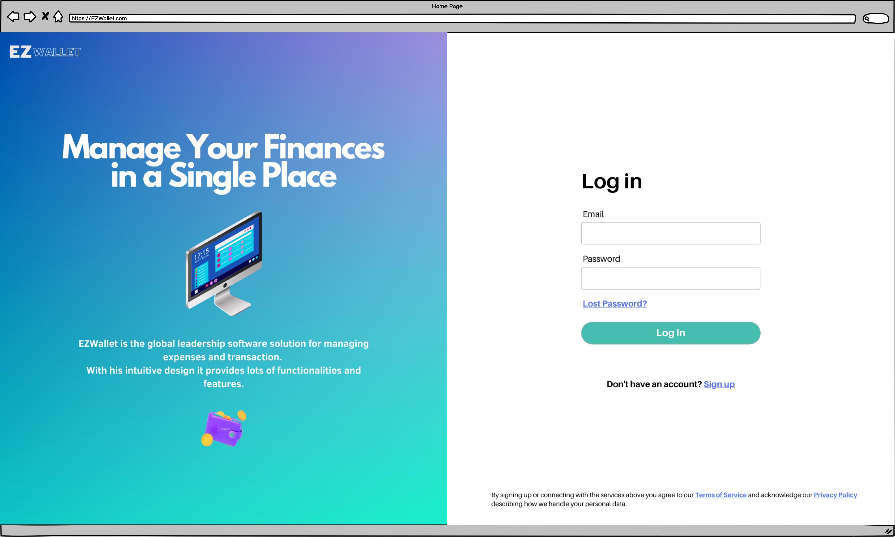
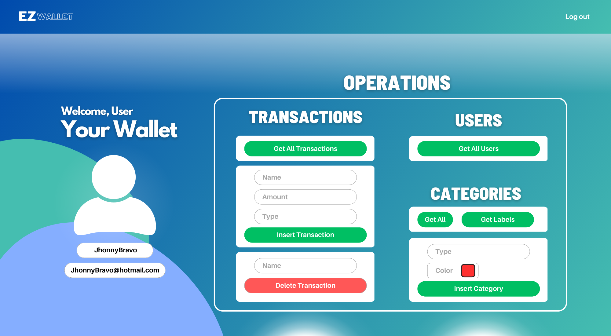

# Graphical User Interface Prototype  - CURRENT

Authors:

Date:

Version:

\<Report here the GUI that you propose for EZWallet in CURRENT form, as received by teachers. You are free to organize it as you prefer. A suggested presentation matches the Use cases and scenarios defined in the Requirement document. The GUI can be shown as a sequence of graphical files (jpg, png)  >
## Login Page
Main landing page, log-in and sign-in are performed in this page.

## Home Page
This is the main wallet page, here the user can perform different actions.

