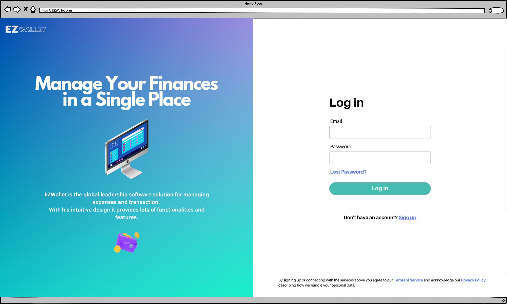
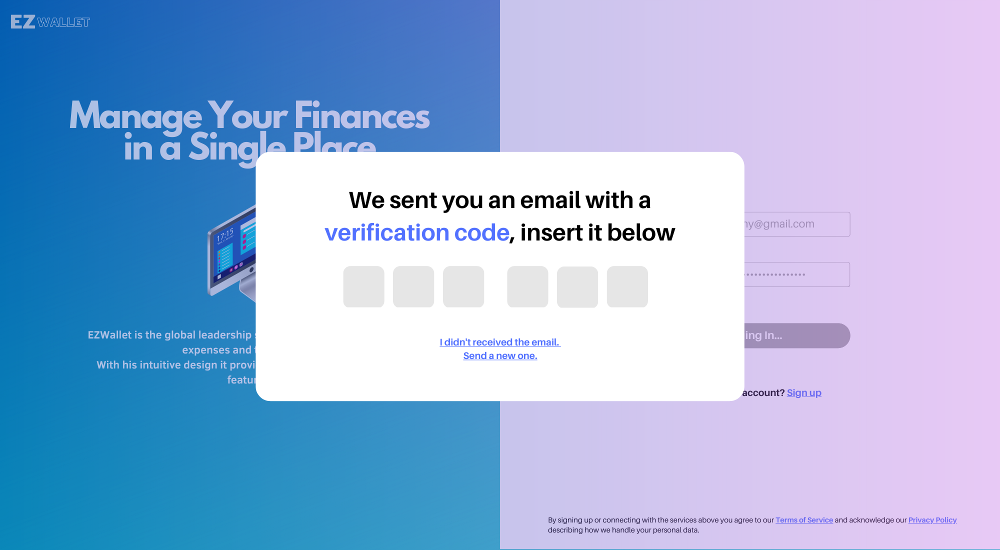
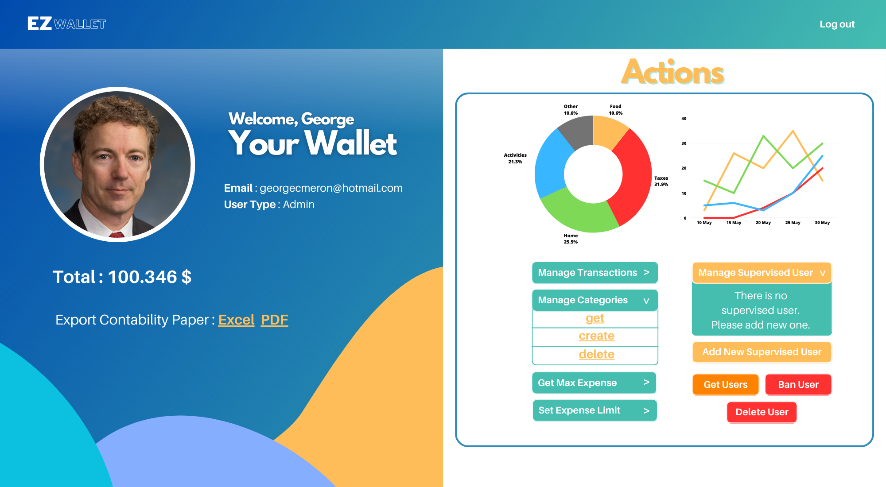
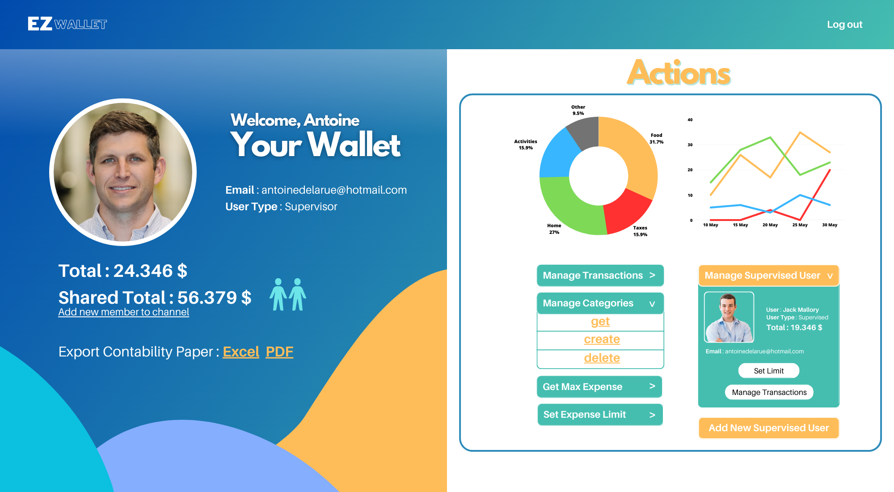
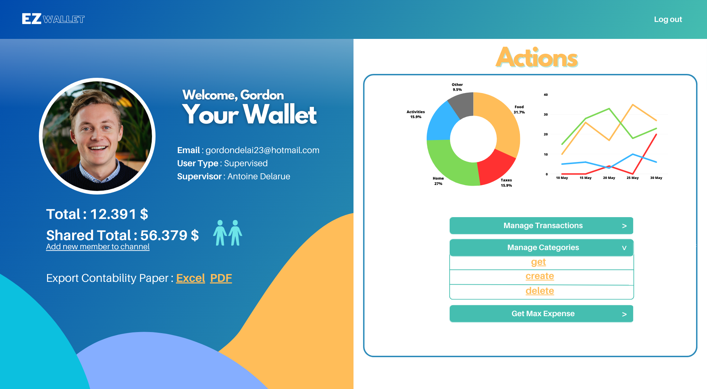
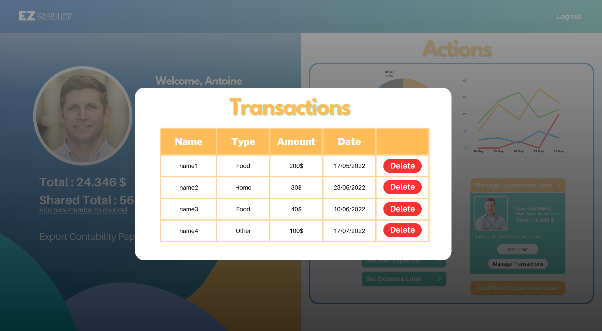

# Graphical User Interface Prototype  - FUTURE

Authors: Andrea Vannozzi

Date: 24 apr 2023

Version: 2

## Login Page
Main landing page, log-in and sign-in are performed in this page.

## Login Page - Verification Code
After Log In Button press, the verification code is requested.

## Home Page Admin
This is the main wallet page of an Admin User, here the Admin can perform different actions.

## Home Page Supervisor
This is the main wallet page of a Supervisor User, here the Supervisor can perform different actions.

## Home Page Supervised
This is the main wallet page of an Supervised User, here the Supervised can perform different actions.

## Transaction List Pop-up
This pop-up appears after a the pression of the "Get All Transactions" button. From this view the User can delete the the transactions.

