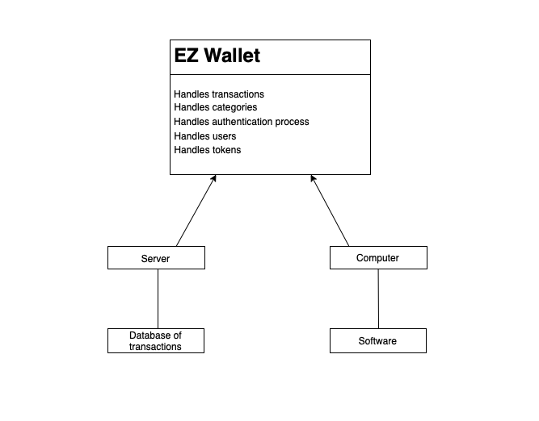

# Requirements Document - current EZWallet

Date:  18 apr 2023

Version: V1 - description of EZWallet in CURRENT form (as received by teachers)

 
| Version number | Change |
| ----------------- |:-----------|
| 1 |  23 |

# Contents

- [Informal description](#informal-description)
- [Stakeholders](#stakeholders)
- [Context Diagram and interfaces](#context-diagram-and-interfaces)
	+ [Context Diagram](#context-diagram)
	+ [Interfaces](#interfaces) 
	
- [Stories and personas](#stories-and-personas)
- [Functional and non functional requirements](#functional-and-non-functional-requirements)
	+ [Functional Requirements](#functional-requirements)
	+ [Non functional requirements](#non-functional-requirements)
- [Use case diagram and use cases](#use-case-diagram-and-use-cases)
	+ [Use case diagram](#use-case-diagram)
	+ [Use cases](#use-cases)
    	+ [Relevant scenarios](#relevant-scenarios)
- [Glossary](#glossary)
- [System design](#system-design)
- [Deployment diagram](#deployment-diagram)
- [Defects and Bugs](#defect-and-bugs)

# Informal description
EZWallet (read EaSy Wallet) is a software application designed to help individuals and families keep track of their expenses. Users can enter and categorize their expenses, allowing them to quickly see where their money is going. EZWallet is a powerful tool for those looking to take control of their finances and make informed decisions about their spending.

# Stakeholders

| Stakeholder name  | Description | 
| ----------------- |:-----------:|
| User | A user is a person who interacts with the software. User can be customer. Customers are people who use the software for its purpose, to keep track of expenses and we can identify for example privates, small business owners, freelancers, students, retired people. | 
| Developer | This role represents the person/team who developed the code/command lines of the software |
| CEO of company / company | This stakeholder represents who initialized the project, handling its management and financially sustaining it |
| Investors | People that showed interest in the project and its development and wanted to participate so invested a sum of money in the company which is developing the software or directly in the project |
| Marketing specialists | Is a person/team assumed to give the project more visibility and to attract the right segment of market |
| Data analyst | This role studies the data created by the usage of the software, to improve its functionalities or the data created by the users, to furnish the marketing specialist important information for his/her work |
| Domain registration organization | When the website app is developed, the domain of the website must be registered by a specific entity |
| Government | It plays an important role as a regulator of the company developing the project in three aspects: bureaucratic, financial, and legislative |
| Enviroment | The environment must be considered as a fixed stakeholder due to the fact the server used by the software is energy spending, which is taken from the environment. It needs to be taken in consideration at a company level to create more business value (eg: Triple Bottom Line countability) |

# Context Diagram and interfaces

## Context Diagram

## Interfaces

| Actor | Physical Interface | Logical Interface  |
| ------------- |:-------------:| -----:|
|   User    | Screen, Keyboard, Mouse, Input peripheral devices | GUI |
|   Developer    | Screen, Keyboard, Mouse, Input peripheral devices | Command line interface |

# Stories and personas

### Personas 1: User → Family member
---
The Family member is the one in charge of managing the expenses of a family. Upon registration on the system, the subject can log on to the application, which can be a mobile application, to view, operate, manage, and eventually upgrade all the expenses of his family.

### Personas 2: User → Business Owner
---
A business owner is a subject who uses the system to manage business expenses, such as tracking employee expense reports or handling invoices.

A business owner can interact with the system using an app designed to use the API of EZwallet, which can be used from a tablet, a PC, or a smartphone.

### Personas 3: User → Student
---
A student is a subject who uses the system to manage personal expenses, such as student loans, rent, or textbooks.

He can use the mobile app.

### Personas 4: User → Traveler
---
A traveler is a subject who uses the system to manage their travel expenses, such as flights, accommodations, and food expenses.

He can use the mobile app, that can work offline.

### Personas 5: User → Retiree
---
A retiree is a subject who uses the system to manage their retirement savings and expenses, such as managing their social security, pension, and investment accounts.

He can use the mobile app, very intuitive to use and minimal in design.

### Personas 6:  IT Admin → System admin
---
The system admin can manage the application subsystem in a special area provided in the web-based version of the app.

### Personas 7: Buyer → Application developer
---
An application developer could use the API and the web-based system as a backbone for a mobile app. As an application developer, in this case, we mean a subject that could be an activity that spans from the single freelancer who develops alone the app to the big office that has more resources to produce the application.

# Functional and non functional requirements

## Functional Requirements

| ID        | Description  |
| ------------- |:-------------:| 
|  FR1     | Authenticate users |
|  FR1.1   | Register new users |
|  FR1.2   | Login users |
|  FR1.3   | Logout users |
|  FR2     | Manage users |
|  FR2.1   | Get users |
|  FR2.2   | Get user by username |
|  FR3     | Manage transactions |
|  FR3.1   | Create transactions | 
|  FR3.2   | Get transactions | 
|  FR3.3   | Delete transactions | 
|  FR4     | Manage cathegories |
|  FR4.1   | Create cathegories | 
|  FR4.2   | Get cathegories | 
|  FR5     | Manage labels |
|  FR5.1   | Get labels | 
|  FR6     | Return error message for all unexpected cases |  

## Non Functional Requirements

| ID        | Type (efficiency, reliability, ..)           | Description  | Refers to |
| ------------- |:-------------:| :-----:| -----:|
|  NFR1     | Usability | All users should be able to add new transactions and cathegories without problems | FR3 |
|  NFR2     | Efficiency | Serves large number of requests at the same time without making delays bigger than 2s |  |
|  NFR3     | Availability | App should be available always and on all popular services |  |
|  NFR4     | Security | Passwords should be encripted | FR1 | 
|  NFR5     | Privacy | Users should not be able to see other users data and transactions |  |  

# Use case diagram and use cases

## Use case diagram

### Use case 1 - User registration on the web-app

| Actors involved | User |
| --- | --- |
| Precondition | The user needs to create an account |
| Postcondition | The user has the account created |
| Nominal scenario | The user made a registration |
| Variants | - |
| Exceptions | - |

***Scenario 1.1***

The user surf the site for the first time and don't have an account.

| Scenario 1.1 |  |
| --- | --- |
| Precondition | The user needs to create an account |
| Postcondition | The user has the account created |
| Step 1 | The user access the site for the first time |
| Step 2 | The site asks the user to log on the first page |
| Step 3 | The user can't log in since he had to create one, so he activates the link under the login button ("create new account") |
| Step 4 | The user is redirected in a new page, with a form the user compiles with his email and his password |
| Step 5 | The user activates the "create new account button" |
| Step 6 | Now the site redirects the user to the first page where he can access with the newly created account |

### Use case 2 - User login

| Actors involved | User |
| --- | --- |
| Precondition | The user needs to log in to the web app |
| Postcondition | The user is successfully logged on to the web app |
| Nominal scenario | The user logs in using his credential after opening the app |
| Variants | - |
| Exceptions | wrong credentials |

***Scenario 2.1***

Independently from the devices he is using when accessing the web application for the first time, the user is requested to log in.

In this scenario, we suppose the user already has an account.

| Scenario 2.1 |  |
| --- | --- |
| Precondition | The user needs to log in to the web app |
| Postcondition | The user is successfully logged on to the web app |
| Step 1 | The user access the site after some time or for the first time |
| Step 2 | The user is requested to insert his credentials |
| Step 3 | The user inserts his credentials |
| Step 4 | After authentication, the user is logged  |

***Scenario 2.2***

Independently from the devices he is using when accessing the web application for the first time, the user is requested to log in.

In this scenario, we suppose the user already has an account and inserts wrong credentials.

| Scenario 2.2 |  |
| --- | --- |
| Precondition | The user needs to log in to the web app |
| Postcondition | The user is successfully logged on to the web app |
| Step 1 | The user access the site after some time or for the first time |
| Step 2 | The user is requested to insert his credentials |
| Step 3 | The user inserts his credentials |
| Step 4 | The credentials the user has inserted are wrong |
| Step 5 | An alert message araise |
| Step 6 | The operation has failed |

### Use case 3 - Developer Login

| Actors involved | Developer |
| --- | --- |
| Precondition | A person in charge of manage the code needs to log in |
| Postcondition | The developer is logged in |
| Nominal scenario | The developer log in the system with some specific, pre generated, credential |
| Variants | - |
| Exceptions | The developer inserts wrong credentials |

***Scenario 3.1***

The developer logs in to the system with some special, specific, credentials that gaved to him.

| Scenario 3.1 |  |
| --- | --- |
| Precondition | A person in charge of manage the code needs to log in |
| Postcondition | The developer is logged in |
| Step 1 | The developer goes to the backend access panel of the system  |
| Step 2 | The backend access panel requests some credentials |
| Step 3 | The developer inserts his credentials |
| Step 4 | After successful authentication, the developer is logged in  |

***Scenario 3.2***

The developer logs in to the system with some special, specific, credentials that gaved to him, and he inserts them wrong.

| Scenario 3.2 |  |
| --- | --- |
| Precondition | The developer needs to log in to the web app |
| Postcondition | The developer is successfully logged on to the web app |
| Step 1 | The developer access the site after some time or for the first time |
| Step 2 | The developer is requested to insert his credentials |
| Step 3 | The developer inserts his credentials |
| Step 4 | The credentials the developer has inserted are wrong |
| Step 5 | An alert message araise |
| Step 6 | The operation has failed 

### Use case 4 - Create category

| Actors involved | User |
| --- | --- |
| Precondition | A user wants to create a new category |
| Postcondition | The new category is successfully created |
| Nominal scenario | The user creates the new category from the specific section of the site |
| Variants | - |
| Exceptions | Category already present |

***Scenario 4.1***

The user creates a new category from the specific section of the site.
In the backend, the site requests the system to create a new category that will be created with the create_category()
method of the API.

| Scenario 4.1 |  |
| --- | --- |
| Precondition | A user want to create a new category |
| Postcondition | The new cateory is successfully created |
| Step 1 | The user access the site  |
| Step 2 | The user goes to the site menu, under the section categories |
| Step 3 | The user press the plus button under the caregories section |
| Step 4 | The site asks the user to specify a category name and optionally a label  |
| Step 5 | The new category is created  |

***Scenario 4.2***

The user creates the new category with the name of a category already present.

| Scenario 4.2 |  |
| --- | --- |
| Precondition | A user want to create a new category |
| Postcondition | The new category is successfully created |
| Step 1 | The user access the site  |
| Step 2 | The user goes to the site menu, under the section categories |
| Step 3 | The user presses the plus button under the categories section |
| Step 4 | The site asks the user to specify a category name and optionally a label  |
| Step 5 | The user inserts the name of a category already present  |
| Step 6 | An error is raised  |

### Use case 5 - Category view

| Actors involved | User |
| --- | --- |
| Precondition | A user wants to view all his categories |
| Postcondition | The categories are displayed |
| Nominal scenario | The user views the category from the specific section of the web app |
| Variants | - |
| Exceptions | - |

***Scenario 5.1***

The user can see all the categories in the first page (after the login) of the web-app, the first one he see accesing the site.
All the categories present on the site are fetched using the get_categories() method.

| Scenario 5.1 |  |
| --- | --- |
| Precondition | A user wants to view all his categories |
| Postcondition | The categories are displayed |
| Step 1 | The user access the site previous authentication  |
| Step 2 | The user can see all the categories in the center of the screen |

### Use case 6 - Create transaction

| Actors involved | User |
| --- | --- |
| Precondition | A user wants to create a new transaction |
| Postcondition | The new transaction is created and registered |
| Nominal scenario | The user creates a new transaction from the main page of the web app, selecting if the transaction is a revenue or an expense |
| Variants | revenue, expense |
| Exceptions | - |

***Scenario 6.1***

The user wants to add a new revenue to the web app, he can add an "additive" transaction.
The transaction is managed by the create_transaction() method.

| Scenario 6.1 |  |
| --- | --- |
| Precondition | A user wants to create a new transaction |
| Postcondition | The new transaction is created and registered |
| Step 1 | The user access the web application and locates the ‘plus’ button in the main section of the site |
| Step 2 | Now the user is in the “add revenue” section, where he could insert a value as revenue |
| Step 3 | The user could also add a comment to this new revenue |
| Step 4 | Now the user must select a category (ex. salary, una-tantum, ex…) that classifies the revenue. |
| Step 5 | Once a category is selected the revenues are automatically saved in the system |

***Scenario 6.2***

The user wants to add a new expense to the site, he can add a "subtractive" transaction.
The transaction is managed by the create_transaction() method.

| Scenario 6.2 |  |
| --- | --- |
| Precondition | A user wants to create a new transaction |
| Postcondition | The new transaction is created and registered |
| Step 1 | The user access the web application and locates the ‘minus’ button in the main section of the site |
| Step 2 | Now the user is in the “add expense” section, where he could insert a value as expense |
| Step 3 | The user could also add a comment to this new expense |
| Step 4 | Now the user must select a category (ex. shopping, home, ex…) that classifies the expense. |
| Step 5 | Once a category is selected the expense are automatically saved in the system |

### Use case 7 - Delete transaction

| Actors involved | User |
| --- | --- |
| Precondition | A user wants to delete a transaction |
| Postcondition | The transaction is deleted |
| Nominal scenario | The user can delete a transaction from the main transaction view, he can chose to remove a revenue or an expense |
| Variants | revenue, expense |
| Exceptions | - |

***Scenario 7.1***

The user wants to remove a revenue recorded, maybe because that is erroneous or because he doesn’t want to record something as revenue.
The removing process is managed using the delete_transaction() method.

| Scenario 7.1 |  |
| --- | --- |
| Precondition | A user wants to delete a transaction |
| Postcondition | The transaction is deleted |
| Step 1 | The user access the web application and locates the graph at the top of the main section. |
| Step 2 | Clicking the graph leads the user to a more detailed view of the transactions |
| Step 3 | The user opens the revenue that wants to remove. |
| Step 4 | On the top right corner of the page, there is a bin icon, the user activates it |
| Step 5 | A pop-up message appears and asks the user if he’s sure he wants to delete the revenue |
| Step 6 | The user activates the “yes” option |
| Step 7 | The revenue is deleted |

***Scenario 7.2***

The user wants to remove an expense recorded, maybe because that is erroneous or because he doesn’t want to record something as an expense.
The removing process is managed using the delete_transaction() method.

| Scenario 7.2 |  |
| --- | --- |
| Precondition | A user wants to delete a transaction |
| Postcondition | The transaction is deleted |
| Step 1 | The user access the web application and locate the graph at the top of the main section. |
| Step 2 | Clicking the graph leads the user to a more detailed view of the transactions |
| Step 3 | The user opens the expenses that want to remove. |
| Step 4 | On the top right corner of the page, there is a bin icon, the user activates it |
| Step 5 | A pop-up message appears and asks the user if he’s sure he wants to delete the expense |
| Step 6 | The user activates the “yes” option |
| Step 7 | The expense is deleted |

### Use case 8 - Transactions view

| Actors involved | User |
| --- | --- |
| Precondition | A user wants to get a detailed view of his transactions |
| Postcondition | A detailed view of the transacition is displayed in some graph form |
| Nominal scenario | The user can see all his transaction in a graph form in a specific section of the site |
| Variants | - |
| Exceptions | - |

***Scenario 8.1***

The user can see all his transaction in a graph form in a specific section of the site, that retrives them with the get_transactions() method, and also get_lables().

| Scenario 8.1 |  |
| --- | --- |
| Precondition | A user wants to get a detailed view of his transactions |
| Postcondition | A detailed view of the transacition is displayed in some graph form |
| Step 1 | The user access the web application and locates the graph at the top of the main section. |
| Step 2 | Clicking the graph leads the user to a more detailed view of the transactions |

### Use case 9 - Get Users
| Actors involved | User |
| --- | --- |
| Precondition | A user wants to get the list of users |
| Postcondition | The list of users is displayed in some graph form |
| Nominal scenario | The user can see the list of all users in a graph form in a specific section of the site |
| Variants | - |
| Exceptions | - |

| Scenario 9.1 |  |
| --- | --- |
| Precondition | A user wants to get the list of users |
| Postcondition | The list of users is displayed in some graph form |
| Step 1 | The user access the web application and use the specific button to request the list of users |
| Step 2 | Clicking the button the list of users is showed |

### Use case 10 - Get User Info
| Actors involved | User |
| --- | --- |
| Precondition | A user wants to get  of his own informations |
| Postcondition | The users information are displayed |
| Nominal scenario | The user can see the list of its own informations |
| Variants | - |
| Exceptions | - |

| Scenario 10.1 |  |
| --- | --- |
| Precondition | A user wants to get  of his own informations |
| Postcondition | The users information are displayed |
| Step 1 | The user access the web application |
| Step 2 | The informations are automatically showed as the user enter the web app |

### Use case 11 - API access

| Actors involved | Developer |
| --- | --- |
| Precondition | The developer needs to access the API of the EZWallet system through requests |
| Postcondition | EZWallet system responds to the requests with da data |
| Nominal scenario | The developer needs to perform requests to the system to retrieve the data for the web application |
| Variants | - |
| Exceptions | Wrong request |

***Scenario 11.1***

The developer needs to perform requests to the system in order to retrieve the data for the application, the request can be done via HTTP or better via HTTPS through GET/POST requests

| Scenario 11.1 |  |
| --- | --- |
| Precondition | The developer needs to access the API of the EZWallet system through requests |
| Postcondition | EZWallet system responds to the requests with da data |
| Step 1 | The Developer prepares the request in the language he’s using |
| Step 2 | The developer performs the request to the address of the server on which the EZWallet is running |
| Step 3 | The system responds with the needed data |

***Scenario 11.2***

The developer request is invalid

| Scenario 11.2 |  |
| --- | --- |
| Precondition | The developer needs to access the API of the EZWallet system through requests |
| Postcondition | EZWallet system responds to the requests with da data |
| Step 1 | The Developer prepares the request in the language he’s using |
| Step 2 | The developer performs the request to the address of the server on which the EZWallet is running |
| Step 3 | The system responds with a message error |

# Glossary

# System Design

# Deployment Diagram 

# Defect and Bugs
At the time of writing the software contains 2 defects which must be resolved in further versions :

| Bugs/Defect | |
| --- | --- |
| Defect | The Get Users function should be called only by and Admin users, but there is such implementation of User with Admin features |
| Bug | Inside "./code/controllers/controller.js" line 77 (getLabels() function) v.color must be replaced with v.categories_info.color |

