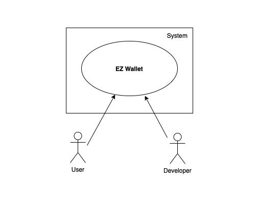

# Requirements Document - future EZWallet

Date: 23 apr 2023

Version: V2 - description of EZWallet in FUTURE form (as proposed by the team)

 
| Version number | Change |
|------|:------:|
| 2.1 | 13|

# Contents

- [Informal description](#informal-description)
- [Business model](#business-model)
- [Stakeholders](#stakeholders)
- [Context Diagram and interfaces](#context-diagram-and-interfaces)
	+ [Context Diagram](#context-diagram)
	+ [Interfaces](#interfaces) 
	
- [Stories and personas](#stories-and-personas)
- [Functional and non functional requirements](#functional-and-non-functional-requirements)
	+ [Functional Requirements](#functional-requirements)
	+ [Non functional requirements](#non-functional-requirements)
- [Use case diagram and use cases](#use-case-diagram-and-use-cases)
	+ [Use case diagram](#use-case-diagram)
	+ [Use cases](#use-cases)
 	+ [Relevant scenarios](#relevant-scenarios)
- [Glossary](#glossary)
- [System design](#system-design)
- [Deployment diagram](#deployment-diagram)

# Informal description
EZWallet (read EaSy Wallet) is a software application designed to help individuals and families keep track of their expenses. Users can enter and categorize their expenses, allowing them to quickly see where their money is going. EZWallet is a powerful tool for those looking to take control of their finances and make informed decisions about their spending. New features have been introduced to implement the efficiency of the software, both to users and to admin and developers: this new features are for example,  the possibility for users to supervise other users that might be part of the family or employers, the possibility to have statistics of expenses and export documents of transactions and the possibility to create periodic transactions, in order to create at the same time, a more professional and safe enviroment of work or daily routine tracking.

# Business model
As there are already few similar free apps on the market, our model focuses on our app to be free as well, but to the best competition with better UI, design and better features. Goal isn't to make money on the specific app but to get into the market and than sell our developing services by making similarly themed apps, APIs or SaaS specifically for the needs of large companies and corporations(ex. banks, financial institutions, sales companies etc.).

# Stakeholders

| Stakeholder name | Description | 
| ----------------- |:-----------:|
| User | A user is a person who interacts with the software. We can divide them into customers and admins. Customers are people who use the software for its purpose, to keep track of expenses, and we can identify for example privates, small business owners, freelancers, students, retired people. Also users can have roles like supervisor and supervised those are more useful in a setting where one or more people may want to keep track and limit other. On the other hand, admins are insiders who control the software’s efficiency and functioning: we identified IT admins and website admin | 
| Developer | This role represents the person/team who developed the code/command lines of the software and maintains it |
| CEO of company / company | This stakeholder represents who initialized the project, handling its management and financially sustaining it |
| Investors | People that showed interest in the project and its development and wanted to participate so invested a sum of money in the company which is developing the software or directly in the project |
| Marketing specialists | Is a person/team assumed to give the project more visibility and to attract the right segment of market |
| Data analyst | This role studies the data created by the usage of the software, to improve its functionalities or the data created by the users, to furnish the marketing specialist important information for his/her work |
| Domain registration organization | When the website app is developed, the domain of the website must be registered by a specific entity |
| Government | It plays an important role as a regulator of the company developing the project in three aspects: bureaucratic, financial, and legislative |
| Environment | The environment must be considered as a fixed stakeholder due to the fact the server used by the software is energy spending, which is taken from the environment. It needs to be taken in consideration at a company level to create more business value (eg: Triple Bottom Line count ability) | 
| Mail service provider | Role of a service provider for mail authentication of user when he registers or logs in after a while, it needs to be reliable and secure(double authentication) | 

# Context Diagram and interfaces

## Context Diagram

## Interfaces

| Actor | Physical Interface | Logical Interface |
| ------------- |:-------------:|:-----:|
| User | Screen, Keyboard, Mouse, Input peripheral devices | GUI |
| Developer | Screen, Keyboard, Mouse, Input peripheral devices | Command line interface |

# Stories and personas

### Personas 1: User → Family member
---
The Family member is the one in charge of managing the expenses of a family. Upon registration on the system, the subject can log on to the application, which can be a mobile application, to view, operate, manage, and eventually upgrade all the expenses of his family.

### Personas 2: User → Business Owner
---
A business owner is a subject who uses the system to manage business expenses, such as tracking employee expense reports or handling invoices.

A business owner can interact with the system using an app designed to use the API of EZwallet, which can be used from a tablet, a PC, or a smartphone.

### Personas 3: User → Student
---
A student is a subject who uses the system to manage personal expenses, such as student loans, rent, or textbooks.

He can use the mobile app.

### Personas 4: User → Traveler
---
A traveler is a subject who uses the system to manage their travel expenses, such as flights, accommodations, and food expenses.

He can use the mobile app, that can work offline.

### Personas 5: User → Retiree
---
A retiree is a subject who uses the system to manage their retirement savings and expenses, such as managing their social security, pension, and investment accounts.

He can use the mobile app, very intuitive to use and minimal in design.

### Personas 6: User → Supervisor
---
A supervisor is a user who has one or more associated supervised. He is responsible for the limits of the supervised users he manages. For example, the supervised users can be children and the supervisor's role relies on their parents. A supervisor can set expenses limits to his supervised users, get a list of expenses of his supervised users and their particular category.

### Personas 7: User → Supervised
---
A supervised is a user who has one associated supervisor. It has the same functions of a normal user with the extension of a limited privacy or an expense boundary, managed by the supervisor. It is important to remark that not all regular users are supervised, but all supervised are regular users.

### Personas 8: Admin → System admin
---
The system admin can manage the application subsystem in a special area provided in the web-based version of the app. In this area, he can manage users and, in case of absence of recent activity of a user, ban them, solve problems, improve security, and overall manage the system. Furthermore he has the possibility to make a backup of the system and store it locally with the proper policy.

### Personas 9: Buyer → Application developer
---
An application developer could use the API and the web-based system as a backbone for a mobile app. As an application developer, in this case, we mean a subject that could be an activity that spans from the single freelancer who develops alone the app to the big office that has more resources to produce the application.

# Functional and non functional requirements

## Functional Requirements

| ID | Description |
| ------------- |:-------------:| 
| FR1 | Auth. Users |
| FR1.1 | Reg. New users (Normal User, Supervisor or Supervised) |
| FR1.2 | Login users |
| FR1.2.1 | Send an Email Code Verification (2-steps authentication) |
| FR1.3 | Logout users |
| FR2 | Manage users (Admin only) |
| FR2.1 | Get users |
| FR2.2 | Get user by username |
| FR2.3 | Delete/Ban User |
| FR3 | Manage Supervised (Supervisor only) |
| FR3.1 | Get all supervised users |
| FR3.2 | Set expenses limit |
| FR3.2.1 | "/day |
| FR3.2.2 | "/month |
| FR3.2.3 | "/year |
| FR3.3 | Get all transactions of a specific supervised user |
| FR3.3.1 | Get all transactions per category of a specific user |
| FR3.4 | Get maximum expense of a specific supervised user |
| FR3.4.1 | Get maximum expense per category of a specific supervised user |
| FR4 | Manage transactions (All users) |
| FR4.1 | Create transactions | 
| FR4.2 | Get transactions | 
| FR4.3 | Delete transactions | 
| FR4.4 | Set expenses limit (except for Supervised users) | 
| FR4.5 | Get Maximum expense | 
| FR4.5.1 | Get Maximum expense per category | 
| FR4.6 | Periodic monthly transaction insertion, the ability to insert a periodic transaction which will be automatically inserted by the system (ex. monthly Gym fee, monthly ISP fee, ...) |
| FR5 | Manage categories |
| FR5.1 | Create categories | 
| FR5.2 | Get categories | 
| FR6 | Manage labels |
| FR6.1 | Get labels | 
| FR7 | Send an email in case of expenses limit exceeded (to supervisor in case of supervised user) | 
| FR8 | Create a shared channel between two or more users, they can share transactions (ex. family) | 
| FR9 | Return error message for all unexpected cases | 
| FR10 | Export Pdf/Exel file as a cont ability paper | 

## Non Functional Requirements

| ID | Type (efficiency, reliability, ..)  | Description | Refers to |
| ------------- |:-------------:| :-----:| -----:|
| NFR1 | Usability | All users should be able to add new transactions and categories without problems | FR3 |
| NFR2 | Efficiency | Serves large number of requests at the same time without making delays bigger than 2s | |
| NFR3 | Availability | App should be available always | |
| NFR4 | Security | Passwords should be encrypted | FR1 | 
| NFR5 | Privacy | Users should not be able to see other users data and transactions | All FR related to the users' data (ex FR2, FR3.1, FR3.3...) | 
| NFR6 | Reliability | Possibility for the IT Admin to perform backups over system | |
| NFR7 | Security | Email verification system | FR1.2.1 |

# Use case diagram and use cases

## Use case diagram

### Use case 1 - User registration on the web-app

| Actors involved | User |
| --- | --- |
| Precondition | The user needs to create an account |
| Post condition | The user has the account created |
| Nominal scenario | The user made a registration |
| Variants | - |
| Exceptions | Email inserted is already used |

***Scenario 1.1***

The user surfs the site for the first time and don't have an account.

| Scenario 1.1 | |
| --- | --- |
| Precondition | The user needs to create an account |
| Post condition | The user has the account created |
| Step 1 | The user access the site for the first time |
| Step 2 | The site asks the user to log on the first page |
| Step 3 | The user can't log in since he had to create one, so he activates the link under the login button ("create new account") |
| Step 4 | The user is redirected in a new page, with a form the user compiles with his email and his password |
| Step 5 | The user activates the "create new account button" |
| Step 6 | Now the site redirects the user to the first page where he can access with the newly created account |

***Scenario 1.2***

The user surfs the site for the first time and don't have an account, he registers with an email already present on the system.

| Scenario 1.2 | |
| --- | --- |
| Precondition | The user needs to create an account |
| Post condition | The user has the account created |
| Step 1 | The user access the site for the first time |
| Step 2 | The site asks the user to log on the first page |
| Step 3 | The user can't log in since he had to create one, so he activates the link under the login button ("create new account") |
| Step 4 | The user is redirected in a new page, with a form the user compiles with his email and his password |
| Step 5 | The user has inserted an email already used |
| Step 6 | A message arise |

### Use case 2 - User login

| Actors involved | User |
| --- | --- |
| Precondition | The user needs to log in to the web app |
| Post condition | The user is successfully logged on to the web app |
| Nominal scenario | The user logs in using his credential after opening the app |
| Variants | - |
| Exceptions | - |

***Scenario 2.1***

Independently of the devices he is using when accessing the web application for the first time, the user is requested to log in.

In this scenario, we suppose the user already has an account.

| Scenario 2.1 | |
| --- | --- |
| Precondition | The user needs to log in to the web app |
| Post condition | The user is successfully logged on to the web app |
| Step 1 | The user access the site after some time or for the first time |
| Step 2 | The user is requested to insert his credentials |
| Step 3 | The user inserts his credentials |
| Step 4 | After authentication, the user is logged |

### Use case 3 - Developer Login

| Actors involved | Developer |
| --- | --- |
| Precondition | A person in charge of manage the code needs to log in |
| Post condition | The developer is logged in |
| Nominal scenario | The developer log in the system with some specific, pre generated, credential |
| Variants | - |
| Exceptions | - |

***Scenario 3.1***

The developer logs in to the system with some special, specific, credentials that gave to him.

| Scenario 3.1 | |
| --- | --- |
| Precondition | A person in charge of manage the code needs to log in |
| Post condition | The developer is logged in |
| Step 1 | The developer goes to the backend access panel of the system |
| Step 2 | The backend access panel requests some credentials |
| Step 3 | The developer inserts his credentials |
| Step 4 | After successful authentication, the developer is logged in |

### Use case 4 - Create category

| Actors involved | User |
| --- | --- |
| Precondition | A user wants to create a new category |
| Post condition | The new category is successfully created |
| Nominal scenario | The user creates the new category from the specific section of the site |
| Variants | - |
| Exceptions | Category already present |

***Scenario 4.1***

The user creates a new category from the specific section of the site.
In the backend, the site requests the system to create a new category that will be created with the create_category()
method of the API.

| Scenario 4.1 | |
| --- | --- |
| Precondition | A user want to create a new category |
| Post condition | The new category is successfully created |
| Step 1 | The user access the site |
| Step 2 | The user goes to the site menu, under the section categories |
| Step 3 | The user press the plus button under the categories section |
| Step 4 | The site asks the user to specify a category name and optionally a label |
| Step 5 | The new category is created |

***Scenario 4.2***

The user creates the new category with the name of a category already present.

| Scenario 4.2 | |
| --- | --- |
| Precondition | A user want to create a new category |
| Post condition | The new category is successfully created |
| Step 1 | The user access the site |
| Step 2 | The user goes to the site menu, under the section categories |
| Step 3 | The user presses the plus button under the categories section |
| Step 4 | The site asks the user to specify a category name and optionally a label |
| Step 5 | The user inserts the name of a category already present |
| Step 6 | An error is raised |

### Use case 5 - Category view

| Actors involved | User |
| --- | --- |
| Precondition | A user wants to view all his categories |
| Post condition | The categories are displayed |
| Nominal scenario | The user views the category from the specific section of the web app |
| Variants | - |
| Exceptions | - |

***Scenario 5.1***

The user can see all the categories in the first page (after the login) of the web-app, the first one he sees accessing the site.
All the categories present on the site are fetched using the get_categories() method.

| Scenario 5.1 | |
| --- | --- |
| Precondition | A user wants to view all his categories |
| Post condition | The categories are displayed |
| Step 1 | The user access the site previous authentication |
| Step 2 | The user can see all the categories in the center of the screen |

### Use case 6 - Create transaction

| Actors involved | User |
| --- | --- |
| Precondition | A user wants to create a new transaction |
| Post condition | The new transaction is created and registered |
| Nominal scenario | The user creates a new transaction from the main page of the web app, selecting if the transaction is a revenue or an expense |
| Variants | revenue, expense, periodic transaction |
| Exceptions | - |

***Scenario 6.1***

The user wants to add a new revenue to the web app, he can add an "additive" transaction.
The transaction is managed by the create_transaction() method.

| Scenario 6.1 | |
| --- | --- |
| Precondition | A user wants to create a new transaction |
| Post condition | The new transaction is created and registered |
| Step 1 | The user access the web application and locates the ‘plus’ button in the main section of the site |
| Step 2 | Now the user is in the “add revenue” section, where he could insert a value as revenue |
| Step 3 | The user could also add a comment to this new revenue |
| Step 4 | Now the user must select a category (ex. salary, una-tantum, ex…) that classifies the revenue. |
| Step 5 | Once a category is selected the revenues are automatically saved in the system |

***Scenario 6.2***

The user wants to add a new expense to the site, he can add a "subtracting" transaction.
The transaction is managed by the create_transaction() method.

| Scenario 6.2 | |
| --- | --- |
| Precondition | A user wants to create a new transaction |
| Post condition | The new transaction is created and registered |
| Step 1 | The user access the web application and locates the ‘minus’ button in the main section of the site |
| Step 2 | Now the user is in the “add expense” section, where he could insert a value as expense |
| Step 3 | The user could also add a comment to this new expense |
| Step 4 | Now the user must select a category (ex. shopping, home, ex…) that classifies the expense. |
| Step 5 | Once a category is selected the expense are automatically saved in the system |

***Scenario 6.3***

The user wants to have the possibility to register periodic expenses, such as subscriptions. The transaction is managed by the create_periodic_transaction() method.

| Scenario 6.2 | |
| --- | --- |
| Precondition | A user wants to create a new transaction |
| Post condition | The new transaction is created and registered |
| Step 1 | The user access the web application and locates the ‘minus’ button in the main section of the site |
| Step 2 | Now the user is in the “add periodic expense” section, where he could insert a value as expense |
| Step 3 | The user could add a date of registration and the frequency of this new expense |
| Step 3 | The user could also add a comment to this new expense |
| Step 4 | Now the user must select a category (ex. shopping, home, ex…) that classifies the expense. |
| Step 5 | Once a category is selected the expense are automatically saved in the system and will periodically appear as declared|

### Use case 7 - Delete transaction

| Actors involved | User |
| --- | --- |
| Precondition | A user wants to delete a transaction |
| Post condition | The transaction is deleted |
| Nominal scenario | The user can delete a transaction from the main transaction view, he can choose to remove a revenue or an expense |
| Variants | revenue, expense |
| Exceptions | - |

***Scenario 7.1***

The user wants to remove a revenue recorded, maybe because that is erroneous or because he doesn’t want to record something as revenue.
The removing process is managed using the delete_transaction() method.

| Scenario 7.1 | |
| --- | --- |
| Precondition | A user wants to delete a transaction |
| Post condition | The transaction is deleted |
| Step 1 | The user access the web application and locates the graph at the top of the main section. |
| Step 2 | Clicking the graph leads the user to a more detailed view of the transactions |
| Step 3 | The user opens the revenue that wants to remove. |
| Step 4 | In the top right corner of the page, there is a bin icon, the user activates it |
| Step 5 | A pop-up message appears and asks the user if he’s sure he wants to delete the revenue |
| Step 6 | The user activates the “yes” option |
| Step 7 | The revenue is deleted |

***Scenario 7.2***

The user wants to remove an expense recorded, maybe because that is erroneous or because he doesn’t want to record something as an expense.
The removing process is managed using the delete_transaction() method.

| Scenario 7.2 | |
| --- | --- |
| Precondition | A user wants to delete a transaction |
| Post condition | The transaction is deleted |
| Step 1 | The user access the web application and locate the graph at the top of the main section. |
| Step 2 | Clicking the graph leads the user to a more detailed view of the transactions |
| Step 3 | The user opens the expenses that want to remove. |
| Step 4 | In the top right corner of the page, there is a bin icon, the user activates it |
| Step 5 | A pop-up message appears and asks the user if he’s sure he wants to delete the expense |
| Step 6 | The user activates the “yes” option |
| Step 7 | The expense is deleted |

### Use case 8 - Transactions view

| Actors involved | User |
| --- | --- |
| Precondition | A user wants to get a detailed view of his transactions |
| Post condition | A detailed view of the transaction is displayed in some graph form |
| Nominal scenario | The user can see all his transaction in a graph form in a specific section of the site |
| Variants | - |
| Exceptions | - |

***Scenario 8.1***

The user can see all his transaction in a graph form in a specific section of the site, that retrives them with the get_transactions() method, and also get_lables().

| Scenario 8.1 | |
| --- | --- |
| Precondition | A user wants to get a detailed view of his transactions |
| Post condition | A detailed view of the transaction is displayed in some graph form |
| Step 1 | The user access the web application and locates the graph at the top of the main section. |
| Step 2 | Clicking the graph leads the user to a more detailed view of the transactions |

### Use case 9 - Statistics view

| Actors involved | User |
| --- | --- |
| Precondition | A user wants to get statistics about his transactions throughout a specific period |
| Post condition | Some statistics of the transactions are displayed in a graph form |
| Nominal scenario | The user can see, in a specific section of the site, the statistics of the transactions, such as average monthly stock, maximum monthly expense, maximum monthly revenue or percentile of transactions for each category |
| Variants | - |
| Exceptions | - |

***Scenario 9.1***

The user can see, in a specific section of the site, the statistics of the transactions, displayed in a graph form.

| Scenario 9.1 | |
| --- | --- |
| Precondition | A user wants to get statistics about his transactions throughout a specific period |
| Post condition | Some statistics of the transactions are displayed in a graph form |
| Step 1 | The user access the web application and locates the specific section of the statistics |
| Step 2 | The specific section shows a more detailed view of all the statistics |

### Use case 10 - Transaction document export

| Actors involved | User |
| --- | --- |
| Precondition | A user wants to export a file declaring all transactions throughout a specific period |
| Post condition | A PDF file of the transactions is exported and ready to download in a tabular form |
| Nominal scenario | The user can export, from a specific section of the site, a document containing all the positive and negative transactions of a specified period |
| Variants | The file can also be exported in excel format |
| Exceptions | - |

***Scenario 10.1***

The user can export in PDF format a document containing all the positive and negative transactions of a specified period, with method exported()

| Scenario 10.1 | |
| --- | --- |
| Precondition | A user wants to export a file declaring all transactions throughout a specific period |
| Post condition | A PDF file of the transactions is exported and ready to download in a tabular form |
| Step 1 | The user access the web application and locates the specific button to export the document |
| Step 2 | Clicking the button permits the download of a PDF file with all transaction |

***Scenario 10.2***

The user can export in excel format a document containing all the positive and negative transactions of a specified period, with method exportExcel()

| Scenario 10.2 | |
| --- | --- |
| Precondition | A user wants to export a file declaring all transactions throughout a specific period |
| Post condition | A PDF file of the transactions is exported and ready to download in a tabular form |
| Step 1 | The user access the web application and locates the specific button to export the document |
| Step 2 | Clicking the button permits the download of an excel file with all transaction |

### Use case 11 - Shared transaction

| Actors involved | User |
| --- | --- |
| Precondition | A user wants to track a transaction, shared with another person |
| Post condition | The user can manage a shared "lobby" where can be added shared transactions |
| Nominal scenario | |
| Variants | - |
| Exceptions | - |

***Scenario 11.1***

The user can manage a shared "lobby" where can be added shared transactions, by changing the personal area to a shared area thanks to a drop down menu.

| Scenario 11.1 | |
| --- | --- |
| Precondition | A user wants to track a transaction, shared with another person |
| Post condition | The user can manage a shared "lobby" where can be added shared transactions |
| Step 1 | The user wants to switch from personal area to a shared transaction "lobby" |
| Step 2 | From a drop down menu, the user is able to do the switch |
| Step 3 | In the shared "lobby", the user is able to manage the transactions in common |

### Use case 12 - Supervisor control

| Actors involved | Supervisor |
| --- | --- |
| Precondition | A user who has the role of supervisor wants to control one or more supervised users |
| Post condition | The supervisor is able to set expenses limits and have specific information about transactions of the supervised users |
| Nominal scenario | The supervisor can set expenses limits to his supervised users |
| Variant 1 | The supervisor can get a list of expenses of his supervised users and their particular category |
| Variant 2 | The supervisor can get a list of the categories of all transactions made by their supervised users |
| Exceptions | - |

***Scenario 12.1***

The supervisor can set expenses limits to his supervised users thanks to the method setLimitsToSupervised()

| Scenario 12.1 | |
| --- | --- |
| Precondition | A user who has the role of supervisor wants to control one or more supervised users |
| Post condition | The supervisor is able to set expenses limits and have specific information about transactions of the supervised users |
| Step 1 | The supervisor accesses a specific section that is particularly reserved to the control of his supervised, where he can set a limit inserting the specific number |
| Step 2 | The supervised users, whenever he reaches the specific digit, cannot add any expense |

***Scenario 12.2***

The supervisor can get a list of expenses of his supervised users thanks to the method getTransactionsSupervised() 

| Scenario 12.2 | |
| --- | --- |
| Precondition | A user who has the role of supervisor wants to control one or more supervised users |
| Post condition | The supervisor is able to set expenses limits and have specific information about transactions of the supervised users |
| Step 1 | The supervisor accesses a specific section that is particularly reserved to information about the supervised user's expenses|
| Step 2 | Accessing the section permits a more detailed view of all the transactions made by the supervised users |

***Scenario 12.3***

The supervisor can get a list of the categories of all transactions made by his supervised users thanks to the method getCategorySupervised()

| Scenario 12.3 | |
| --- | --- |
| Precondition | A user who has the role of supervisor wants to control one or more supervised users |
| Post condition | The supervisor is able to set expenses limits and have specific information about transactions of the supervised users |
| Step 1 | The supervisor accesses a specific section that is particularly reserved to information about the supervised user's expenses|
| Step 2 | Accessing the section permits a more detailed view of all the categories associated with the transactions made by the supervised users |

Admin have the possibility to make a backup of the system and store it locally with the proper policy

### Use case 13 - System backup

| Actors involved | Admin |
| --- | --- |
| Precondition | The admin wants to have a copy of the system |
| Post condition | The admin is able to perform a backup of the system and store it locally with the proper policy |
| Nominal scenario | The admin has to store the backups the server periodically compute based on company policy |
| Variant | - |
| Exceptions | - |

***Scenario 13.1***

The company policy expects the Admin to retrieve the backups the sever periodically do and store it inside the locals servers of the company, they need to be strong against external dangers (like fire or earthquake) and the data needs to be encrypted.
Backups are retrieved weekly.

| Scenario 13.1 | |
| --- | --- |
| Precondition | The admin wants to have a copy of the system |
| Post condition | The admin is able to perform a backup of the system and store it locally with the proper policy |
| Step 1 | The Admin access the backend of the server |
| Step 2 | The Admin go on the backups section |
| Step 3 | The Admin download the latest backup |
| Step 4 | The Admin store it into local servers |

### Use case 14 - API access

| Actors involved | Developer |
| --- | --- |
| Precondition | The developer needs to access the API of the Wallet system through requests |
| Post condition | Wallet system responds to the requests with the data |
| Nominal scenario | The developer needs to perform requests to the system to retrieve the data for the web application |
| Variants | - |
| Exceptions | Wrong request |

***Scenario 14.1***

The developer needs to perform requests to the system in order to retrieve the data for the application, the request can be done via HTTP or better via HTTPS through GET/POST requests

| Scenario 14.1 | |
| --- | --- |
| Precondition | The developer needs to access the API of the Wallet system through requests |
| Post condition | Wallet system responds to the requests with the data |
| Step 1 | The Developer prepares the request in the language he’s using |
| Step 2 | The developer performs the request to the address of the server on which the Wallet is running |
| Step 3 | The system responds with the needed data |

***Scenario 14.2***

The developer request is invalid

| Scenario 14.2 | |
| --- | --- |
| Precondition | The developer needs to access the API of the Wallet system through requests |
| Post condition | Wallet system responds to the requests with the data |
| Step 1 | The Developer prepares the request in the language he’s using |
| Step 2 | The developer performs the request to the address of the server on which the Wallet is running |
| Step 3 | The system responds with a message error |

### Use case 15 - Get Users
| Actors involved | User |
| --- | --- |
| Precondition | A user wants to get the list of users |
| Post condition | The list of users is displayed in some graph form |
| Nominal scenario | The user can see the list of all users in a graph form in a specific section of the site |
| Variants | - |
| Exceptions | - |

| Scenario 15.1 | |
| --- | --- |
| Precondition | A user wants to get the list of users |
| Post condition | The list of users is displayed in some graph form |
| Step 1 | The user access the web application and use the specific button to request the list of users |
| Step 2 | Clicking the button the list of users is showed |

# Glossary

# System Design

# Deployment Diagram 

