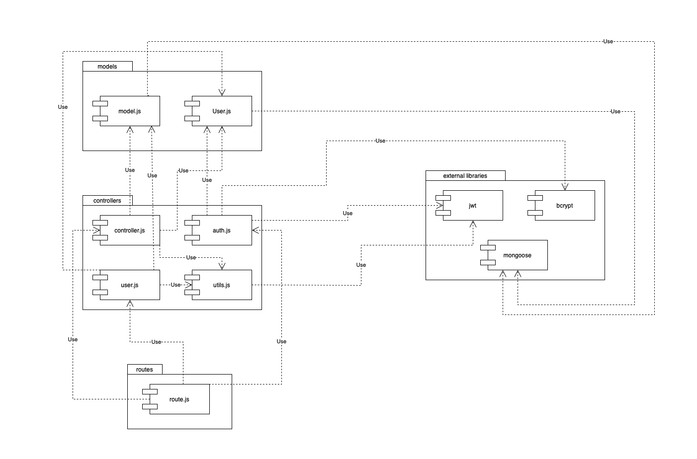
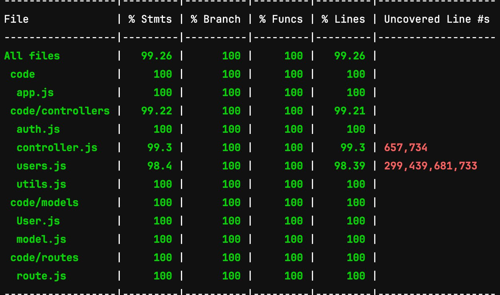

# Test Report

# Contents

- [Dependency graph](#dependency-graph)

- [Integration approach](#integration-approach)

- [Tests](#tests)

- [Coverage](#Coverage)

# Dependency graph 

     
# Integration approach
>In our project implementation, we have chosen to adopt a **Bottom-Up Approach**. We first made all the unit test and once all functions were tested singularly, we started with the Integration.
>First we started with the Basic Functions of Utils.js (they were called by all other functions), then we started "mounting" together all the functions.
Here are the steps we followed :

1. We first tested the behaviour of **verifyAuth** function
2. We tested the other functions in Utils.js ( **handleAmountFilters** and **handleDateFilters** ) as they serve as a support for the other functions of the project
3. We started implementing the test for the controller.js functions

Finaly we made a sort of functional test by running the system and performing calls to the specific "routes", making an evaluation of the general behaviour of the system. 

# Tests

| Test case name                                                                                                                                                                                                                                      | Object(s) tested                 | Test level  | Technique used     |
|-----------------------------------------------------------------------------------------------------------------------------------------------------------------------------------------------------------------------------------------------------|----------------------------------|-------------|--------------------|
| Response data Content: A message confirming successful insertion | register | Unit | BB/eq partitioning |
| Returns a 400 error if the request body does not contain all the necessary attributes | register | Unit | BB/eq partitioning |
| Returns a 400 error if at least one of the parameters in the request body is an empty string | register | Unit | BB/eq partitioning |
| Returns a 400 error if the email in the request body is not in a valid email format | register | Unit | BB/eq partitioning |
| Returns a 400 error if the username in the request body identifies an already existing user | register | Unit | BB/eq partitioning |
| Returns a 400 error if the email in the request body identifies an already existing user | register | Unit | BB/eq partitioning |
| Response data Content: A message confirming successful insertion | registerAdmin | Unit | BB/eq partitioning |
| Returns a 400 error if the request body does not contain all the necessary attributes | registerAdmin | Unit | BB/eq partitioning |
| Returns a 400 error if at least one of the parameters in the request body is an empty string | registerAdmin | Unit | BB/eq partitioning |
| Returns a 400 error if the email in the request body is not in a valid email format | registerAdmin | Unit | BB/eq partitioning |
| Returns a 400 error if the username in the request body identifies an already existing user | registerAdmin | Unit | BB/eq partitioning |
| Returns a 400 error if the email in the request body identifies an already existing user | registerAdmin | Unit | BB/eq partitioning |
| Response data Content: A message confirming successful login | login | Unit | BB/eq partitioning |
| Returns a 400 error if the request body does not contain all the necessary attributes | login | Unit | BB/eq partitioning |
| Returns a 400 error if at least one of the parameters in the request body is an empty string | login | Unit | BB/eq partitioning |
| Returns a 400 error if the email in the request body is not in a valid email format | login | Unit | BB/eq partitioning |
| Returns a 400 error if the email in the request body does not identify a user in the database| login | Unit | BB/eq partitioning |
| General 500 error | login | Unit | BB/eq partitioning |
| Response data Content: A message confirming successful logout | logout | Unit | BB/eq partitioning |
|Returns a 400 error if the request does not have a refresh token in the cookies | logout | Unit | BB/eq partitioning |
| Returns a 400 error if the refresh token in the request’s cookies does not represent a user in the database | logout | Unit | BB/eq partitioning |
| General 500 error | logout | Unit | BB/eq partitioning |
| Should return a 200 response and an object category in json format| createCategory | Unit | BB/eq partitioning |
| Should return a 400 error if the request body does not contain all the necessary attributes| createCategory | Unit | BB/eq partitioning |
| Should return a 400 error if at least one of the parameters in the request body is an empty string| createCategory | Unit | BB/eq partitioning |
| Should return a 400 error if the type of category passed in the request body represents an already existing category in the database| createCategory | Unit | BB/eq partitioning |
| Returns a 401 error if called by an authenticated user who is not an admin (authType = Admin) | createCategory | Unit | BB/eq partitioning |
| Default behavior, should return an object with parameter message that confirms successful editing and parameter count equal to count of transactions whose category was changed with the new type, plus a response code 200| updateCategory | Unit | BB/eq partitioning |
| Should return a 400 error if the request body does not contain all the necessary attributes | updateCategory | Unit | BB/eq partitioning |
| Should return a 400 error if the request body is not a string | updateCategory | Unit | BB/eq partitioning |
| Should return a 400 error if at least one of the parameters in the request body is an empty string | updateCategory | Unit | BB/eq partitioning |
| Should return a 400 error if the type of category passed as a route parameter does not represent a category in the database | updateCategory | Unit | BB/eq partitioning |
| Should return a 400 error if the type of category passed in the request body as the new type represents an already existing category in the database | updateCategory | Unit | BB/eq partitioning |
|Should return a 401 error if called by an authenticated user who is not an admin (authType = Admin)  | updateCategory | Unit | BB/eq partitioning |
| Default case (N = T) | deleteCategory | Unit | BB/eq partitioning |
| Default case (N > T) | deleteCategory | Unit | BB/eq partitioning |
| Default case only one category | deleteCategory | Unit | BB/eq partitioning |
| Categories cannot be empty strings | deleteCategory | Unit | BB/eq partitioning |
| Should return a 401 error if called by an authenticated user who is not an admin (authType = Admin) | deleteCategory | Unit | BB/eq partitioning |
| Should return a 400 error if the request body does not contain all the necessary attributes| deleteCategory | Unit | BB/eq partitioning |
| Should return a 400 error if called when there is only one category in the database| deleteCategory | Unit | BB/eq partitioning |
| Should return a 400 error if at least one of the types in the array is an empty string | deleteCategory | Unit | BB/eq partitioning |
| Should return a 400 error if the category doesn't exist | deleteCategory | Unit | BB/eq partitioning |
| The category does not exist | deleteCategory | Unit | BB/eq partitioning |
| Categories deleted successfully | deleteCategory | Unit | BB/eq partitioning |
|Should return a 200 response and an object category in json format| getCategories | Unit | BB/eq partitioning |
| Should return a 401 error if called by an authenticated user who is not an admin (authType = Admin)| getCategories | Unit | BB/eq partitioning |
| The username passed as a route param does not exists | createTransaction | Unit | BB/eq partitioning |
| One of the body parameters is undefined | createTransaction | Unit | BB/eq partitioning |
| One of the body parameters is an empty string | createTransaction | Unit | BB/eq partitioning |
| The category passed in the request body does not exists | createTransaction | Unit | BB/eq partitioning |
| The username passed in the request body does not exists | createTransaction | Unit | BB/eq partitioning |
| The user passed in the request body is not the same as the one passed as a parameter | createTransaction | Unit | BB/eq partitioning |
| Unauthorized | createTransaction | Unit | BB/eq partitioning |
| Not the same user as the one specified in the route | createTransaction | Unit | BB/eq partitioning |
| Amount not parsable | createTransaction | Unit | BB/eq partitioning |
| Correct behaviour | createTransaction | Unit | BB/eq partitioning |
| Unauthorized | getAllTransactions| Unit | BB/eq partitioning |
| Correct behaviour| getAllTransactions| Unit | BB/eq partitioning |
| The username doesn’t exist | getTransactionsByUser| Unit | BB/eq partitioning |
| Unauthorized | getTransactionsByUser| Unit | BB/eq partitioning |
| Unauthorized2 | getTransactionsByUser| Unit | BB/eq partitioning |
| Normal user route, with filters | getTransactionsByUser| Unit | BB/eq partitioning |
| Normal user route, with filters (V2) | getTransactionsByUser| Unit | BB/eq partitioning |
| Normal user route, with filters (V3) | getTransactionsByUser| Unit | BB/eq partitioning |
| Admin route, without filters | getTransactionsByUser| Unit | BB/eq partitioning |
| Category does not exist | getTransactionsByUserByCategory| Unit | BB/eq partitioning |
| The username doesn't exist | getTransactionsByUserByCategory| Unit | BB/eq partitioning |
| Admin route, unauthorized | getTransactionsByUserByCategory| Unit | BB/eq partitioning |
| Normal user route, unauthorized | getTransactionsByUserByCategory| Unit | BB/eq partitioning |
| Normal user route, with valid category | getTransactionsByUserByCategory| Unit | BB/eq partitioning |
| Returns a 400 error if the name passed as a route parameter does not represent a group in the database | getTransactionsByGroup| Unit | BB/eq partitioning |
| Returns a 401 error if called by an authenticated user who is not an admin| getTransactionsByGroup| Unit | BB/eq partitioning |
|The user is not part of the specified group | getTransactionsByGroup| Unit | BB/eq partitioning |
|Correct behaviour | getTransactionsByGroup| Unit | BB/eq partitioning |
| The group does not exists | getTransactionsByGroupByCategory| Unit | BB/eq partitioning |
| The category does not exists  | getTransactionsByGroupByCategory| Unit | BB/eq partitioning |
| Unauthorized | getTransactionsByGroupByCategory| Unit | BB/eq partitioning |
| The user is not part of the specified group | getTransactionsByGroupByCategory| Unit | BB/eq partitioning |
| Correct behaviour | getTransactionsByGroupByCategory| Unit | BB/eq partitioning |
|Returns a 400 error if the id in the request body does not contain all the necessary attributes | deleteTransaction| Unit | BB/eq partitioning |
|Returns a 400 error if the username passed as a route parameter does not represent a user in the database | deleteTransaction| Unit | BB/eq partitioning |
| Id is not specified | deleteTransaction| Unit | BB/eq partitioning |
| User not authenticated | deleteTransaction| Unit | BB/eq partitioning |
| Transaction deleted | deleteTransaction| Unit | BB/eq partitioning |
| Unauthorized | deleteTransactions | Unit | BB/eq partitioning |
| Please specify a list of ids in form of an array. | deleteTransactions | Unit | BB/eq partitioning |
| Ids cannot be empty strings | deleteTransactions | Unit | BB/eq partitioning |
| Ids needs to be present in the db | deleteTransactions | Unit | BB/eq partitioning |
| Transactions delete| deleteTransactions | Unit | BB/eq partitioning |
| Should return the full list of users| getUsers | Unit | BB/eq partitioning |
| Should return a 401 error if called by an authenticated user who is not an admin| getUsers | Unit | BB/eq partitioning |
| Should retrieve an empty list of users| getUsers | Unit | BB/eq partitioning |
| General 500 error | getUsers | Unit | BB/eq partitioning |
| Should return user information when user exists| getUser | Unit | BB/eq partitioning |
| should return 400 error when user is not found | getUser | Unit | BB/eq partitioning |
|should return a 401 error if called by an authenticated user who is neither the same user as the one in the route parameter nor an admin | getUser | Unit | BB/eq partitioning |
| should return a 200 if called by an admin who is not the same user as the one in the route parameter| getUser | Unit | BB/eq partitioning |
| general error| getUser | Unit | BB/eq partitioning |
| General Error 500 | createGroup | Unit | BB/eq partitioning |
| Returns a 401 error if called by a user who is not authenticated (authType = Simple) | createGroup | Unit | BB/eq partitioning |
| The request body does not contain all the necessary attributes | createGroup | Unit | BB/eq partitioning |
| The group name passed in the request body is an empty string | createGroup | Unit | BB/eq partitioning |
| The group name passed in the request body represents an already existing group in the database | createGroup | Unit | BB/eq partitioning |
| The user who calls the API is already in a group | createGroup | Unit | BB/eq partitioning |
| At least one of the member emails is not in a valid email format | createGroup | Unit | BB/eq partitioning |
| At least one of the member emails is an empty string | createGroup | Unit | BB/eq partitioning |
| All the `memberEmails` either do not exist or they are already in a group | createGroup | Unit | BB/eq partitioning |
| Group created successfully | createGroup | Unit | BB/eq partitioning |
| should return an array of groups when called by an authenticated admin| getGroups | Unit | BB/eq partitioning |
| should return a 401 error if called by an authenticated user who is not an admin| getGroups | Unit | BB/eq partitioning |
| General error| getGroups | Unit | BB/eq partitioning |
| should return a group if called by an authenticated user who is part of the group| getGroup
| Unit | BB/eq partitioning |
| should return a 400 error if the group name does not exist| getGroup | Unit | BB/eq partitioning |
| should return a 401 error if called by an authenticated user who is neither part of the group nor an admin| getGroup | Unit | BB/eq partitioning |
| should return a group if called by an authenticated user who is part of the group| getGroup | Unit | BB/eq partitioning |
| The request body does not contain all the necessary attributes | addToGroup | Unit | BB/eq partitioning |
| Group not found | addToGroup | Unit | BB/eq partitioning |
| At least one of the member emails is not in a valid email format | addToGroup | Unit | BB/eq partitioning |
| At least one of the member emails is an empty string | addToGroup | Unit | BB/eq partitioning |
| Returns a 401 error if called by an authenticated user who is not part of the group  | addToGroup | Unit | BB/eq partitioning |
| Returns a 401 error if called by an authenticated user who is not an admin (authType = Admin) | addToGroup | Unit | BB/eq partitioning |
| All the `memberEmails` either do not exist or are already in a group | addToGroup | Unit | BB/eq partitioning |
| All the `memberEmails` either do not exist or are already in a group (V2) | addToGroup | Unit | BB/eq partitioning |
| Correct behavior | addToGroup | Unit | BB/eq partitioning |
| General error | removeFromGroup | Unit | BB/eq partitioning |
| The request body does not contain all the necessary attributes | removeFromGroup | Unit | BB/eq partitioning |
| Group not found | removeFromGroup | Unit | BB/eq partitioning |
| At least one of the member emails is not in a valid email format | removeFromGroup | Unit | BB/eq partitioning |
| At least one of the member emails is an empty string | removeFromGroup | Unit | BB/eq partitioning |
| The group contains only one member | removeFromGroup | Unit | BB/eq partitioning |
| Called by an authenticated user who is not part of the group | removeFromGroup | Unit | BB/eq partitioning |
| Called by an authenticated user who is not an admin | removeFromGroup | Unit | BB/eq partitioning |
| All the `memberEmails` either do not exist or are not in the group | removeFromGroup | Unit | BB/eq partitioning |
| All the `memberEmails` either do not exist or are not in the group (V2) | removeFromGroup | Unit | BB/eq partitioning |
| Removed from group correctly  | removeFromGroup | Unit | BB/eq partitioning |
| should delete the user and return a success response | deleteUser| Unit | BB/eq partitioning |
| should delete the user and return a success response (V2) | deleteUser| Unit | BB/eq partitioning |
| should delete the user and return a success response (V3) | deleteUser| Unit | BB/eq partitioning |
| should return a 400 error if the request body does not contain all the necessary attributes | deleteUser| Unit | BB/eq partitioning |
| should return a 400 error if the email passed in the request body is an empty string | deleteUser| Unit | BB/eq partitioning |
| should return a 400 error if the email passed in the request body is not in correct email format | deleteUser| Unit | BB/eq partitioning |
| should return a 400 error if the email does not represent a user in the database | deleteUser| Unit | BB/eq partitioning |
| should return a 401 error if called by an authenticated user who is not an admin | deleteUser| Unit | BB/eq partitioning |
| should delete the group and return a success response | deleteGroup| Unit | BB/eq partitioning |
| should return a 400 error if the request body does not contain all the necessary attributes | deleteGroup| Unit | BB/eq partitioning |
| should return a 400 error if the name passed in the request body is an empty string| deleteGroup| Unit | BB/eq partitioning |
| should return a 400 error if the name passed in the request body does not represent a group in the database | deleteGroup| Unit | BB/eq partitioning |
| should return a 401 error if called by an authenticated user who is not an admin| deleteGroup| Unit | BB/eq partitioning |
|The query parameters include `date` together with at least one of `from` or `upTo` | handleDateFilterParameters| Unit | BB/eq partitioning |
| Not a string that represents a date in the format **YYYY-MM-DD**| handleDateFilterParameters| Unit | BB/eq partitioning |
|Case date | handleDateFilterParameters| Unit | BB/eq partitioning |
|Case From and upTo | handleDateFilterParameters| Unit | BB/eq partitioning |
| Case From only | handleDateFilterParameters| Unit | BB/eq partitioning |
|  Case upTo only| handleDateFilterParameters| Unit | BB/eq partitioning |
|  Case upTo not valid string that represents a date in the format **YYYY-MM-DD**| handleDateFilterParameters| Unit | BB/eq partitioning |
| Empty | handleDateFilterParameters| Unit | BB/eq partitioning |
| Access token not passed | verifyAuth | Unit | BB/eq partitioning |
| Refresh token not passed | verifyAuth | Unit | BB/eq partitioning |
| DecodedAccessToken missing infos | verifyAuth | Unit | BB/eq partitioning |
| DecodedRefreshToken missing infos | verifyAuth | Unit | BB/eq partitioning |
| Mismatched users | verifyAuth | Unit | BB/eq partitioning |
| Authorized | verifyAuth | Unit | BB/eq partitioning |
| Token Expired --> access token refreshed | verifyAuth | Unit | BB/eq partitioning |
| Token Expired --> perform login again | verifyAuth | Unit | BB/eq partitioning |
| Token Expired --> other error | verifyAuth | Unit | BB/eq partitioning |
| Other error | verifyAuth | Unit | BB/eq partitioning |
| USER : DecodedAccessToken missing infos | verifyAuth | Unit | BB/eq partitioning |
| USER : DecodedRefreshToken missing infos | verifyAuth | Unit | BB/eq partitioning |
| USER : Mismatched users | verifyAuth | Unit | BB/eq partitioning |
| USER : Token has a username different from the requested one | verifyAuth | Unit | BB/eq partitioning |
| USER : Authorized | verifyAuth | Unit | BB/eq partitioning |
| USER : Token Expired --> "Token has a username different from the requested one | verifyAuth | Unit | BB/eq partitioning |
| USER : Token Expired --> Authorized | verifyAuth | Unit | BB/eq partitioning |
| USER : Token Expired --> perform login again | verifyAuth | Unit | BB/eq partitioning |
| USER : Token Expired --> other error | verifyAuth | Unit | BB/eq partitioning |
| USER : Other error | verifyAuth | Unit | BB/eq partitioning |
| ADMIN : DecodedAccessToken missing infos | verifyAuth | Unit | BB/eq partitioning |
| ADMIN : DecodedRefreshToken missing infos | verifyAuth | Unit | BB/eq partitioning |
| ADMIN : Mismatched users | verifyAuth | Unit | BB/eq partitioning |
| ADMIN : Admin authority needed | verifyAuth | Unit | BB/eq partitioning |
| ADMIN : Authorized | verifyAuth | Unit | BB/eq partitioning |
| ADMIN : Token Expired --> Admin authority needed | verifyAuth | Unit | BB/eq partitioning |
| ADMIN : Token Expired --> Authorized | verifyAuth | Unit | BB/eq partitioning |
| ADMIN : Token Expired --> perform login again | verifyAuth | Unit | BB/eq partitioning |
| ADMIN : Token Expired --> other error | verifyAuth | Unit | BB/eq partitioning |
| ADMIN : Other error | verifyAuth | Unit | BB/eq partitioning |
| GROUP : DecodedAccessToken missing infos | verifyAuth | Unit | BB/eq partitioning |
| GROUP : DecodedRefreshToken missing infos | verifyAuth | Unit | BB/eq partitioning |
| GROUP : Mismatched users | verifyAuth | Unit | BB/eq partitioning |
| GROUP : User is not in the group | verifyAuth | Unit | BB/eq partitioning |
| GROUP : Authorized | verifyAuth | Unit | BB/eq partitioning |
| GROUP : Token Expired --> User is not in the group | verifyAuth | Unit | BB/eq partitioning |
| GROUP : Token Expired --> Authorized | verifyAuth | Unit | BB/eq partitioning |
| GROUP : Token Expired --> perform login again | verifyAuth | Unit | BB/eq partitioning |
| GROUP : Token Expired --> other error | verifyAuth | Unit | BB/eq partitioning |
| GROUP : Other error | verifyAuth | Unit | BB/eq partitioning |
| The Min value must be a numerical value | handleAmountFilterParameters | Unit | BB/eq partitioning |
| The Max value must be a numerical value | handleAmountFilterParameters | Unit | BB/eq partitioning |
| Case Min and Max | handleAmountFilterParameters | Unit | BB/eq partitioning |
| The Max value must be a numerical value (when only Max) | handleAmountFilterParameters | Unit | BB/eq partitioning |
| Case Max only | handleAmountFilterParameters | Unit | BB/eq partitioning |
| Case empty | handleAmountFilterParameters | Unit | BB/eq partitioning |
| Response data Content: A message confirming successful insertion | register | Integration | BB/eq partitioning |
| Returns a 400 error if the request body does not contain all the necessary attributes | register | Integration | BB/eq partitioning |
| Returns a 400 error if at least one of the parameters in the request body is an empty string | register | Integration | BB/eq partitioning |
| Returns a 400 error if the email in the request body is not in a valid email format | register | Integration | BB/eq partitioning |
| Returns a 400 error if the username in the request body identifies an already existing user | register | Integration | BB/eq partitioning |
| Returns a 400 error if the email in the request body identifies an already existing user | register | Integration | BB/eq partitioning |
| Response data Content: A message confirming successful insertion | registerAdmin | Integration | BB/eq partitioning |
| Returns a 400 error if the request body does not contain all the necessary attributes | registerAdmin | Integration | BB/eq partitioning |
| Returns a 400 error if at least one of the parameters in the request body is an empty string | registerAdmin | Integration | BB/eq partitioning |
| Returns a 400 error if the email in the request body is not in a valid email format | registerAdmin | Integration | BB/eq partitioning |
| Returns a 400 error if the username in the request body identifies an already existing user | registerAdmin | Integration | BB/eq partitioning |
| Returns a 400 error if the email in the request body identifies an already existing user | registerAdmin | Integration | BB/eq partitioning |
| Response data Content: A message confirming successful login | login | Integration | BB/eq partitioning |
| Returns a 400 error if the request body does not contain all the necessary attributes | login | Integration | BB/eq partitioning |
| Returns a 400 error if at least one of the parameters in the request body is an empty string | login | Integration | BB/eq partitioning |
| Returns a 400 error if the email in the request body is not in a valid email format | login | Integration | BB/eq partitioning |
| Returns a 400 error if the email in the request body does not identify a user in the database| login | Integration | BB/eq partitioning |
| General 500 error | login | Integration | BB/eq partitioning |
| Response data Content: A message confirming successful logout | logout | Integration | BB/eq partitioning |
|Returns a 400 error if the request does not have a refresh token in the cookies | logout | Integration | BB/eq partitioning |
| Returns a 400 error if the refresh token in the request’s cookies does not represent a user in the database | logout | Integration | BB/eq partitioning |
| General 500 error | logout | Integration | BB/eq partitioning |
| Should return a 200 response and an object category in json format| createCategory | Integration | BB/eq partitioning |
| Should return a 400 error if the request body does not contain all the necessary attributes| createCategory | Integration | BB/eq partitioning |
| Should return a 400 error if at least one of the parameters in the request body is an empty string| createCategory | Integration | BB/eq partitioning |
| Should return a 400 error if the type of category passed in the request body represents an already existing category in the database| createCategory | Integration | BB/eq partitioning |
| Returns a 401 error if called by an authenticated user who is not an admin (authType = Admin) | createCategory | Integration | BB/eq partitioning |
| Default behavior, should return an object with parameter message that confirms successful editing and parameter count equal to count of transactions whose category was changed with the new type, plus a response code 200| updateCategory | Integration | BB/eq partitioning |
| Should return a 400 error if the request body does not contain all the necessary attributes | updateCategory | Integration | BB/eq partitioning |
| Should return a 400 error if the request body is not a string | updateCategory | Integration | BB/eq partitioning |
| Should return a 400 error if at least one of the parameters in the request body is an empty string | updateCategory | Integration | BB/eq partitioning |
| Should return a 400 error if the type of category passed as a route parameter does not represent a category in the database | updateCategory | Integration | BB/eq partitioning |
| Should return a 400 error if the type of category passed in the request body as the new type represents an already existing category in the database | updateCategory | Integration | BB/eq partitioning |
|Should return a 401 error if called by an authenticated user who is not an admin (authType = Admin)  | updateCategory | Integration | BB/eq partitioning |
| Default case (N = T) | deleteCategory | Integration | BB/eq partitioning |
| Default case (N > T) | deleteCategory | Integration | BB/eq partitioning |
| Default case only one category | deleteCategory | Integration | BB/eq partitioning |
| Categories cannot be empty strings | deleteCategory | Integration | BB/eq partitioning |
| Should return a 401 error if called by an authenticated user who is not an admin (authType = Admin) | deleteCategory | Integration | BB/eq partitioning |
| Should return a 400 error if the request body does not contain all the necessary attributes| deleteCategory | Integration | BB/eq partitioning |
| Should return a 400 error if called when there is only one category in the database| deleteCategory | Integration | BB/eq partitioning |
| Should return a 400 error if at least one of the types in the array is an empty string | deleteCategory | Integration | BB/eq partitioning |
| Should return a 400 error if the category doesn't exist | deleteCategory | Integration | BB/eq partitioning |
| The category does not exist | deleteCategory | Integration | BB/eq partitioning |
| Categories deleted successfully | deleteCategory | Integration | BB/eq partitioning |
|Should return a 200 response and an object category in json format| getCategories | Integration | BB/eq partitioning |
| Should return a 401 error if called by an authenticated user who is not an admin (authType = Admin)| getCategories | Integration | BB/eq partitioning |
| The username passed as a route param does not exists | createTransaction | Integration | BB/eq partitioning |
| One of the body parameters is undefined | createTransaction | Integration | BB/eq partitioning |
| One of the body parameters is an empty string | createTransaction | Integration | BB/eq partitioning |
| The category passed in the request body does not exists | createTransaction | Integration | BB/eq partitioning |
| The username passed in the request body does not exists | createTransaction | Integration | BB/eq partitioning |
| The user passed in the request body is not the same as the one passed as a parameter | createTransaction | Integration | BB/eq partitioning |
| Unauthorized | createTransaction | Integration | BB/eq partitioning |
| Not the same user as the one specified in the route | createTransaction | Integration | BB/eq partitioning |
| Amount not parsable | createTransaction | Integration | BB/eq partitioning |
| Correct behaviour | createTransaction | Integration | BB/eq partitioning |
| Unauthorized | getAllTransactions| Integration | BB/eq partitioning |
| Correct behaviour| getAllTransactions| Integration | BB/eq partitioning |
| The username doesn’t exist | getTransactionsByUser| Integration | BB/eq partitioning |
| Unauthorized | getTransactionsByUser| Integration | BB/eq partitioning |
| Unauthorized2 | getTransactionsByUser| Integration | BB/eq partitioning |
| Normal user route, with filters | getTransactionsByUser| Integration | BB/eq partitioning |
| Normal user route, with filters (V2) | getTransactionsByUser| Integration | BB/eq partitioning |
| Normal user route, with filters (V3) | getTransactionsByUser| Integration | BB/eq partitioning |
| Admin route, without filters | getTransactionsByUser| Integration | BB/eq partitioning |
| Category does not exist | getTransactionsByUserByCategory| Integration | BB/eq partitioning |
| The username doesn't exist | getTransactionsByUserByCategory| Integration | BB/eq partitioning |
| Admin route, unauthorized | getTransactionsByUserByCategory| Integration | BB/eq partitioning |
| Normal user route, unauthorized | getTransactionsByUserByCategory| Integration | BB/eq partitioning |
| Normal user route, with valid category | getTransactionsByUserByCategory| Integration | BB/eq partitioning |
| Returns a 400 error if the name passed as a route parameter does not represent a group in the database | getTransactionsByGroup| Integration | BB/eq partitioning |
| Returns a 401 error if called by an authenticated user who is not an admin| getTransactionsByGroup| Integration | BB/eq partitioning |
|The user is not part of the specified group | getTransactionsByGroup| Integration | BB/eq partitioning |
|Correct behaviour | getTransactionsByGroup| Integration | BB/eq partitioning |
| The group does not exists | getTransactionsByGroupByCategory| Integration | BB/eq partitioning |
| The category does not exists  | getTransactionsByGroupByCategory| Integration | BB/eq partitioning |
| Unauthorized | getTransactionsByGroupByCategory| Integration | BB/eq partitioning |
| The user is not part of the specified group | getTransactionsByGroupByCategory| Integration | BB/eq partitioning |
| Correct behaviour | getTransactionsByGroupByCategory| Integration | BB/eq partitioning |
|Returns a 400 error if the id in the request body does not contain all the necessary attributes | deleteTransaction| Integration | BB/eq partitioning |
|Returns a 400 error if the username passed as a route parameter does not represent a user in the database | deleteTransaction| Integration | BB/eq partitioning |
| Id is not specified | deleteTransaction| Integration | BB/eq partitioning |
| User not authenticated | deleteTransaction| Integration | BB/eq partitioning |
| Transaction deleted | deleteTransaction| Integration | BB/eq partitioning |
| Unauthorized | deleteTransactions | Integration | BB/eq partitioning |
| Please specify a list of ids in form of an array. | deleteTransactions | Integration | BB/eq partitioning |
| Ids cannot be empty strings | deleteTransactions | Integration | BB/eq partitioning |
| Ids needs to be present in the db | deleteTransactions | Integration | BB/eq partitioning |
| Transactions delete| deleteTransactions | Integration | BB/eq partitioning |
| Should return the full list of users| getUsers | Integration | BB/eq partitioning |
| Should return a 401 error if called by an authenticated user who is not an admin| getUsers | Integration | BB/eq partitioning |
| Should retrieve an empty list of users| getUsers | Integration | BB/eq partitioning |
| General 500 error | getUsers | Integration | BB/eq partitioning |
| Should return user information when user exists| getUser | Integration | BB/eq partitioning |
| should return 400 error when user is not found | getUser | Integration | BB/eq partitioning |
|should return a 401 error if called by an authenticated user who is neither the same user as the one in the route parameter nor an admin | getUser | Integration | BB/eq partitioning |
| should return a 200 if called by an admin who is not the same user as the one in the route parameter| getUser | Integration | BB/eq partitioning |
| general error| getUser | Integration | BB/eq partitioning |
| General Error 500 | createGroup | Integration | BB/eq partitioning |
| Returns a 401 error if called by a user who is not authenticated (authType = Simple) | createGroup | Integration | BB/eq partitioning |
| The request body does not contain all the necessary attributes | createGroup | Integration | BB/eq partitioning |
| The group name passed in the request body is an empty string | createGroup | Integration | BB/eq partitioning |
| The group name passed in the request body represents an already existing group in the database | createGroup | Integration | BB/eq partitioning |
| The user who calls the API is already in a group | createGroup | Integration | BB/eq partitioning |
| At least one of the member emails is not in a valid email format | createGroup | Integration | BB/eq partitioning |
| At least one of the member emails is an empty string | createGroup | Integration | BB/eq partitioning |
| All the `memberEmails` either do not exist or they are already in a group | createGroup | Integration | BB/eq partitioning |
| Group created successfully | createGroup | Integration | BB/eq partitioning |
| should return an array of groups when called by an authenticated admin| getGroups | Integration | BB/eq partitioning |
| should return a 401 error if called by an authenticated user who is not an admin| getGroups | Integration | BB/eq partitioning |
| General error| getGroups | Integration | BB/eq partitioning |
| should return a group if called by an authenticated user who is part of the group| getGroup | Integration | BB/eq partitioning |
| should return a 400 error if the group name does not exist| getGroup | Integration | BB/eq partitioning |
| should return a 401 error if called by an authenticated user who is neither part of the group nor an admin| getGroup | Integration | BB/eq partitioning |
| should return a group if called by an authenticated user who is part of the group| getGroup | Integration | BB/eq partitioning |
| The request body does not contain all the necessary attributes | addToGroup | Integration | BB/eq partitioning |
| Group not found | addToGroup | Integration | BB/eq partitioning |
| At least one of the member emails is not in a valid email format | addToGroup | Integration | BB/eq partitioning |
| At least one of the member emails is an empty string | addToGroup | Integration | BB/eq partitioning |
| Returns a 401 error if called by an authenticated user who is not part of the group  | addToGroup | Integration | BB/eq partitioning |
| Returns a 401 error if called by an authenticated user who is not an admin (authType = Admin) | addToGroup | Integration | BB/eq partitioning |
| All the `memberEmails` either do not exist or are already in a group | addToGroup | Integration | BB/eq partitioning |
| All the `memberEmails` either do not exist or are already in a group (V2) | addToGroup | Integration | BB/eq partitioning |
| Correct behavior | addToGroup | Integration | BB/eq partitioning |
| General error | removeFromGroup | Integration | BB/eq partitioning |
| The request body does not contain all the necessary attributes | removeFromGroup | Integration | BB/eq partitioning |
| Group not found | removeFromGroup | Integration | BB/eq partitioning |
| At least one of the member emails is not in a valid email format | removeFromGroup | Integration | BB/eq partitioning |
| At least one of the member emails is an empty string | removeFromGroup | Integration | BB/eq partitioning |
| The group contains only one member | removeFromGroup | Integration | BB/eq partitioning |
| Called by an authenticated user who is not part of the group | removeFromGroup | Integration | BB/eq partitioning |
| Called by an authenticated user who is not an admin | removeFromGroup | Integration | BB/eq partitioning |
| All the `memberEmails` either do not exist or are not in the group | removeFromGroup | Integration | BB/eq partitioning |
| All the `memberEmails` either do not exist or are not in the group (V2) | removeFromGroup | Integration | BB/eq partitioning |
| Removed from group correctly  | removeFromGroup | Integration | BB/eq partitioning |
| should delete the user and return a success response | deleteUser| Integration | BB/eq partitioning |
| should delete the user and return a success response (V2) | deleteUser| Integration | BB/eq partitioning |
| should delete the user and return a success response (V3) | deleteUser| Integration | BB/eq partitioning |
| should return a 400 error if the request body does not contain all the necessary attributes | deleteUser| Integration | BB/eq partitioning |
| should return a 400 error if the email passed in the request body is an empty string | deleteUser| Integration | BB/eq partitioning |
| should return a 400 error if the email passed in the request body is not in correct email format | deleteUser | Integration | BB/eq partitioning |
| should return a 400 error if the email does not represent a user in the database | deleteUser| Integration | BB/eq partitioning |
| should return a 401 error if called by an authenticated user who is not an admin | deleteUser| Integration | BB/eq partitioning |
| should delete the group and return a success response | deleteGroup| Integration | BB/eq partitioning |
| should return a 400 error if the request body does not contain all the necessary attributes | deleteGroup| Integration | BB/eq partitioning |
| should return a 400 error if the name passed in the request body is an empty string| deleteGroup| Integration | BB/eq partitioning |
| should return a 400 error if the name passed in the request body does not represent a group in the database | deleteGroup| Integration | BB/eq partitioning |
| should return a 401 error if called by an authenticated user who is not an admin| deleteGroup| Integration | BB/eq partitioning |
|The query parameters include `date` together with at least one of `from` or `upTo` | handleDateFilterParameters| Integration | BB/eq partitioning |
| Not a string that represents a date in the format **YYYY-MM-DD**| handleDateFilterParameters| Integration | BB/eq partitioning |
|Case date | handleDateFilterParameters| Integration | BB/eq partitioning |
|Case From and upTo | handleDateFilterParameters| Integration | BB/eq partitioning |
| Case From only | handleDateFilterParameters| Integration | BB/eq partitioning |
|  Case upTo only| handleDateFilterParameters| Integration | BB/eq partitioning |
|  Case upTo not valid string that represents a date in the format **YYYY-MM-DD**| handleDateFilterParameters| Integration | BB/eq partitioning |
| Empty | handleDateFilterParameters| Integration | BB/eq partitioning |
| Access token not passed | verifyAuth | Integration | BB/eq partitioning |
| Refresh token not passed | verifyAuth | Integration | BB/eq partitioning |
| DecodedAccessToken missing infos | verifyAuth | Integration | BB/eq partitioning |
| DecodedRefreshToken missing infos | verifyAuth | Integration | BB/eq partitioning |
| Mismatched users | verifyAuth | Integration | BB/eq partitioning |
| Authorized | verifyAuth | Integration | BB/eq partitioning |
| Token Expired --> access token refreshed | verifyAuth | Integration | BB/eq partitioning |
| Token Expired --> perform login again | verifyAuth | Integration | BB/eq partitioning |
| Token Expired --> other error | verifyAuth | Integration | BB/eq partitioning |
| Other error | verifyAuth | Integration | BB/eq partitioning |
| USER : DecodedAccessToken missing infos | verifyAuth | Integration | BB/eq partitioning |
| USER : DecodedRefreshToken missing infos | verifyAuth | Integration | BB/eq partitioning |
| USER : Mismatched users | verifyAuth | Integration | BB/eq partitioning |
| USER : Token has a username different from the requested one | verifyAuth | Integration | BB/eq partitioning |
| USER : Authorized | verifyAuth | Integration | BB/eq partitioning |
| USER : Token Expired --> "Token has a username different from the requested one | verifyAuth | Integration | BB/eq partitioning |
| USER : Token Expired --> Authorized | verifyAuth | Integration | BB/eq partitioning |
| USER : Token Expired --> perform login again | verifyAuth | Integration | BB/eq partitioning |
| USER : Token Expired --> other error | verifyAuth | Integration | BB/eq partitioning |
| USER : Other error | verifyAuth | Integration | BB/eq partitioning |
| ADMIN : DecodedAccessToken missing infos | verifyAuth | Integration | BB/eq partitioning |
| ADMIN : DecodedRefreshToken missing infos | verifyAuth | Integration | BB/eq partitioning |
| ADMIN : Mismatched users | verifyAuth | Integration | BB/eq partitioning |
| ADMIN : Admin authority needed | verifyAuth | Integration | BB/eq partitioning |
| ADMIN : Authorized | verifyAuth | Integration | BB/eq partitioning |
| ADMIN : Token Expired --> Admin authority needed | verifyAuth | Integration | BB/eq partitioning |
| ADMIN : Token Expired --> Authorized | verifyAuth | Integration | BB/eq partitioning |
| ADMIN : Token Expired --> perform login again | verifyAuth | Integration | BB/eq partitioning |
| ADMIN : Token Expired --> other error | verifyAuth | Integration | BB/eq partitioning |
| ADMIN : Other error | verifyAuth | Integration | BB/eq partitioning |
| GROUP : DecodedAccessToken missing infos | verifyAuth | Integration | BB/eq partitioning |
| GROUP : DecodedRefreshToken missing infos | verifyAuth | Integration | BB/eq partitioning |
| GROUP : Mismatched users | verifyAuth | Integration | BB/eq partitioning |
| GROUP : User is not in the group | verifyAuth | Integration | BB/eq partitioning |
| GROUP : Authorized | verifyAuth | Integration | BB/eq partitioning |
| GROUP : Token Expired --> User is not in the group | verifyAuth | Integration | BB/eq partitioning |
| GROUP : Token Expired --> Authorized | verifyAuth | Integration | BB/eq partitioning |
| GROUP : Token Expired --> perform login again | verifyAuth | Integration | BB/eq partitioning |
| GROUP : Token Expired --> other error | verifyAuth | Integration | BB/eq partitioning |
| GROUP : Other error | verifyAuth | Integration | BB/eq partitioning |
| The Min value must be a numerical value | handleAmountFilterParameters | Integration | BB/eq partitioning |
| The Max value must be a numerical value | handleAmountFilterParameters | Integration | BB/eq partitioning |
| Case Min and Max | handleAmountFilterParameters | Integration | BB/eq partitioning |
| The Max value must be a numerical value (when only Max) | handleAmountFilterParameters | Integration | BB/eq partitioning |
| Case Max only | handleAmountFilterParameters | Integration | BB/eq partitioning |
| Case empty | handleAmountFilterParameters | Integration | BB/eq partitioning |

# Coverage

## Coverage of FR

| Functional Requirements covered | Test(s)                                                                                                                                                                                                                                                                                                                                                                                                                                                                                                                                                                                                                                                                                                                                                                                                                                                                                                                       | 
|---------------------------------|-------------------------------------------------------------------------------------------------------------------------------------------------------------------------------------------------------------------------------------------------------------------------------------------------------------------------------------------------------------------------------------------------------------------------------------------------------------------------------------------------------------------------------------------------------------------------------------------------------------------------------------------------------------------------------------------------------------------------------------------------------------------------------------------------------------------------------------------------------------------------------------------------------------------------------|
|  FR1    | Manage users                                                                                                                                                                                                                                                                                                                                                                                                                                                                                                                                                                                                                                                                                                                                                                                                                                                                                                                  | 
| FR11 - register | • Response data Content: A message confirming successful insertion • Returns a 400 error if the request body does not contain all the necessary attributes • Returns a 400 error if at least one of the parameters in the request body is an empty string • Returns a 400 error if the email in the request body is not in a valid email format • Returns a 400 error if the username in the request body identifies an already existing user • Returns a 400 error if the email in the request body identifies an already existing user                                                                                                                                                                                                                                                                                                                                                                  |
| FR12 - login | • Response data Content: A message confirming successful login •  Returns a 400 error if the request body does not contain all the necessary attributes • Returns a 400 error if at least one of the parameters in the request body is an empty string  • Returns a 400 error if the email in the request body is not in a valid email format  • Returns a 400 error if the email in the request body does not identify a user in the database • The supplied password does not match with the one in the database • General 500 error                                                                                                                                                                                                                                                                                                                                                                |
| FR13 - logout | • Response data Content: A message confirming successful logout  • Returns a 400 error if the request does not have a refresh token in the cookies • Returns a 400 error if the refresh token in the request’s cookies does not represent a user in the database • General 500 error                                                                                                                                                                                                                                                                                                                                                                                                                                                                                                                                                                                                                              |
| FR14 - registerAdmin | • Response data Content: A message confirming successful insertion • Returns a 400 error if the request body does not contain all the necessary attributes • Returns a 400 error if at least one of the parameters in the request body is an empty string • Returns a 400 error if the email in the request body is not in a valid email format • Returns a 400 error if the username in the request body identifies an already existing user • Returns a 400 error if the email in the request body identifies an already existing user                                                                                                                                                                                                                                                                                                                                                                  |
| FR15 - getUsers | • Should return the full list of users • Should return a 401 error if called by an authenticated user who is not an admin • Should retrieve an empty list of users • General 500 error                                                                                                                                                                                                                                                                                                                                                                                                                                                                                                                                                                                                                                                                                                                            |
| FR16 - getUser | • Should return user information when user exists • should return 400 error when user is not found • should return a 401 error if called by an authenticated user who is neither the same user as the one in the route parameter nor an admin • should return a 200 if called by an admin who is not the same user as the one in the route parameter • general error                                                                                                                                                                                                                                                                                                                                                                                                                                                                                                                                          |
| FR17 - deleteUser | • should delete the user and return a success response •  should delete the user and return a success response (V2) • should delete the user and return a success response (V3) •  should return a 400 error if the request body does not contain all the necessary attributes • should return a 400 error if the email passed in the request body is an empty string •  should return a 400 error if the email passed in the request body is not in correct email format • should return a 400 error if the email does not represent a user in the database •  should return a 401 error if called by an authenticated user who is not an admin                                                                                                                                                                                                                                                  |
| FR2 | Manage groups                                                                                                                                                                                                                                                                                                                                                                                                                                                                                                                                                                                                                                                                                                                                                                                                                                                                                                                 |
| FR21 - createGroup | • General Error 500 • Returns a 401 error if called by a user who is not authenticated (authType = Simple) •  The request body does not contain all the necessary attributes • The group name passed in the request body is an empty string • The group name passed in the request body represents an already existing group in the database • The user who calls the API is already in a group • At least one of the member emails is not in a valid email format • At least one of the member emails is an empty string • All the `memberEmails` either do not exist or they are already in a group • Group created successfully                                                                                                                                                                                                                                                        |
| FR22 - getGroups | • should return an array of groups when called by an authenticated admin • should return a 401 error if called by an authenticated user who is not an admin • General error                                                                                                                                                                                                                                                                                                                                                                                                                                                                                                                                                                                                                                                                                                                                           |
| FR23 - getGroup | • should return a group if called by an authenticated user who is part of the group • should return a 400 error if the group name does not exist •  should return a 401 error if called by an authenticated user who is neither part of the group nor an admin • should return a group if called by an authenticated user who is part of the group                                                                                                                                                                                                                                                                                                                                                                                                                                                                                                                                                                |
| FR24 - addToGroup | • The request body does not contain all the necessary attributes • Group not found •  At least one of the member emails is not in a valid email format •  At least one of the member emails is an empty string • Returns a 401 error if called by an authenticated user who is not part of the group • Returns a 401 error if called by an authenticated user who is not an admin (authType = Admin) •  All the `memberEmails` either do not exist or are already in a group • All the `memberEmails` either do not exist or are already in a group (V2) • Correct behavior                                                                                                                                                                                                                                                                                                                   |
| FR25 - removeFromGroup | • General error • The request body does not contain all the necessary attributes • Group not found • At least one of the member emails is not in a valid email format • At least one of the member emails is an empty string • The group contains only one member • Called by an authenticated user who is not part of the group • Called by an authenticated user who is not an admin •  All the `memberEmails` either do not exist or are not in the group • All the `memberEmails` either do not exist or are not in the group (V2) •  Removed from group correctly                                                                                                                                                                                                                                                                                                                |
| FR26 - deleteGroup | • should delete the group and return a success response • should return a 400 error if the request body does not contain all the necessary attributes • return a 400 error if the name passed in the request body is an empty string • should return a 400 error if the name passed in the request body does not represent a group in the database • should return a 401 error if called by an authenticated user who is not an admin                                                                                                                                                                                                                                                                                                                                                                                                                                                                         |
|  FR3   | Manage  transactions                                                                                                                                                                                                                                                                                                                                                                                                                                                                                                                                                                                                                                                                                                                                                                                                                                                                                                          |
| FR31 - createTransaction| • The username passed as a route param does not exists •  One of the body parameters is undefined • One of the body parameters is an empty string •  The category passed in the request body does not exists • The username passed in the request body does not exists • The user passed in the request body is not the same as the one passed as a parameter • Unauthorized • Not the same user as the one specified in the route • Amount not parsable • Correct behaviour                                                                                                                                                                                                                                                                                                                                                                                                              |
| FR32 - getAllTransactions | • Unauthorized  • correct behaviour                                                                                                                                                                                                                                                                                                                                                                                                                                                                                                                                                                                                                                                                                                                                                                                                                                                                                       |
| FR33 - getTransactionsByUser  | • The username doesn’t exist • unauthorized • unauthorized2 • Normal user route with filters • Normal user route, with filters (V2) • Normal user route, with filters (V3) • Admin route, without filters                                                                                                                                                                                                                                                                                                                                                                                                                                                                                                                                                                                                                                                                                             |
| FR34 - getTransactionsByUserByCategory| • Category does not exist • The username doesn't exist • Admin route • unauthorized • Normal user route • unauthorized • Normal user route, with valid category                                                                                                                                                                                                                                                                                                                                                                                                                                                                                                                                                                                                                                                                                                                                       |
| FR35 - getTransactionsByGroup | • Returns a 400 error if the name passed as a route parameter does not represent a group in the database • Returns a 401 error if called by an authenticated user who is not an admin • The user is not part of the specified group • Correct behaviour                                                                                                                                                                                                                                                                                                                                                                                                                                                                                                                                                                                                                                                           |
| FR36 - getTransactionsByGroupByCategory | • The group does not exists • The category does not exists • Unauthorized • The user is not part of the specified group • Correct behaviour                                                                                                                                                                                                                                                                                                                                                                                                                                                                                                                                                                                                                                                                                                                                                                   |
| FR37 - deleteTransaction | • Returns a 400 error if the id in the request body does not contain all the necessary attributes • Returns a 400 error if the username passed as a route parameter does not represent a user in the database • Id is not specified • User not authenticated • Transaction deleted                                                                                                                                                                                                                                                                                                                                                                                                                                                                                                                                                                                                                            |
| FR38 - deleteTransactions | • Unauthorized • Please specify a list of ids in form of an array. • Ids cannot be empty strings • Ids needs to be present in the db • Transactions deleted                                                                                                                                                                                                                                                                                                                                                                                                                                                                                                                                                                                                                                                                                                                                                   |
|  FR4  | Manage categories                                                                                                                                                                                                                                                                                                                                                                                                                                                                                                                                                                                                                                                                                                                                                                                                                                                                                                             |
| FR41 - createCategory | • Should return a 200 response and an object category in json format • Should return a 400 error if the request body does not contain all the necessary attributes • Should return a 400 error if at least one of the parameters in the request body is an empty string •  Should return a 400 error if the type of category passed in the request body represents an already existing category in the database •  Returns a 401 error if called by an authenticated user who is not an admin (authType = Admin)                                                                                                                                                                                                                                                                                                                                                                                              |
| FR42 - updateCategory | • Default behavior • should return an object with parameter message that confirms successful editing and parameter count equal to count of transactions whose category was changed with the new type, plus a response code 200 •  Should return a 400 error if the request body does not contain all the necessary attributes  •  Should return a 400 error if at least one of the parameters in the request body is an empty string  • Should return a 400 error if the type of category passed as a route parameter does not represent a category in the database  •  Should return a 400 error if the type of category passed in the request body as the new type represents an already existing category in the database • Should return a 401 error if called by an authenticated user who is not an admin (authType = Admin) • Should return a 400 error if the request body is not a string |
| FR43 - deleteCategory | • Default case (N = T), Default case (N > T)  • Default case only one category • Categories cannot be empty strings • Should return a 401 error if called by an authenticated user who is not an admin (authType = Admin) • Should return a 400 error if the request body does not contain all the necessary attributes • Should return a 400 error if called when there is only one category in the database • Should return a 400 error if at least one of the types in the array is an empty string •  Should return a 400 error if the category doesn't exist •  The category does not exist • Categories deleted successfully                                                                                                                                                                                                                                                        |
| FR44 - getCategories | • Should return a 200 response and an object category in json format • Should return a 401 error if called by an authenticated user who is not an admin (authType = Admin)                                                                                                                                                                                                                                                                                                                                                                                                                                                                                                                                                                                                                                                                                                                                                      |

## Coverage white box

